# RAMDE: Assignment 1 - Report
## Introduction

This assignment was done in the scope of the RAMDE course, which is part of the *Engenharia de Sistemas Computacionais Críticos*, or **MESC**, master's degree lectured at Instituto Superior de Engenharia do Porto (ISEP).

The RAMDE course consists on teaching model-oriented engineering applied to critical systems, focusing on the software development process which involves requirement analysis, using validation/verification tools based on models and application testing.

This repository holds the work of 2 students:

| Student         | Number  | Email               | Github                     |
|-----------------|---------|---------------------|----------------------------|
| Pedro Pires     | 1221063 | 1221063@isep.ipp.pt | https://github.com/Pireza  |
| Ângelo Oliveira | 1221818 | 1221818@isep.ipp.pt | https://github.com/1221818 |

## Problem

This assignment revolves around a problem relating to **state machines**.

> A state machine is a **behaviour model**. It consists of a finite number of states and is therefore also called **finite-state machine** (FSM). Based on the current state and a given input the machine performs state transitions and produces outputs.

The basic building blocks of a state machine are **states** and **transitions**.

A **state** is a situation in the system that depends on previous inputs and causes a reaction on following inputs. The FSM can change from one state to another, based on a specific input that it is given, and this is called a **transition**.

Depending on the output producing agent, which can be either the state or the transition itself, there can be different FSMs types. 

This assigment revolves around the [**Moore**](#moore) and [**Mealy**](#mealy) FSM types, which return the output in the states and transitions of the machine, respectively. When used to describe a specific system, both **Moore and Mealy FSMs represent the exact same thing**, and it is even possible to translate one into the other without losing expressiveness.

This assignment will consist in implementing the following example using Moore and Mealy FSMs: 

> - A circuit with two distinct buttons, **On** and **Off**, and a **light bulb**
> - The **On** button controls the light bulb's brightness level, which can be **dim**, **medium** and **bright**
> - If the light is **On**, **no matter the level of brightness**, if the **Off** button is pressed then the light goes out
> - If the light is **Off**, the **On** button lights it **dim**
> - If the light is **On**, the **On** button cycles through the aforementioned light levels (dim - medium - bright - dim - ...) 
	
### Moore

Moore machines consist of states and transitions. States are able to produce outputs, and **the output is determined solely by the current state, not by any input**. The picture below illustrates the light example using a Moore FSM. 


### Mealy

Mealy machines **produce outputs only on transitions and not in states**. This often results in state diagrams with fewer states because more logic can be put on transitions. The picture below illustrates the light example using a Mealy FSM. 

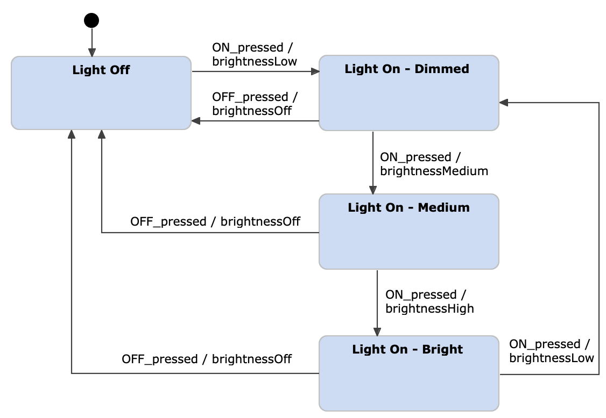

## Requirements for the Assignment

The requirements for this assignment are as follows:

- Evaluate the project regarding design and coding best practices  
- Evaluate if the project supports Moore State Machines. If not, try to update the project to support it  
- Evaluate if the project supports Mealy State Machines. If not, try to update the project to support it  
- Use the project to create a Moore state machine for the light switch example  
- Use the project to create a Mealey state machine for the light switch example  
- Analyse the unit tests of the project and, if necessary, add more tests to improve coverage  
- Report your work in the readme file of the repository  


## Solution Design

1. GRASP
2. GoF
3. SOLID
4. DDD

### 1. GRASP

In Object-Oriented Analysis and Design, General Responsibility Assignment Software Patterns (GRASP) play a crucial role in designing effective and maintainable software systems. **GRASP** offers a set of guidelines to aid developers in assigning responsibilities to classes.

In this section, the **GRASP** will be explained and then an analysis will be performed on the **Easy States** framework. More information on this can be found [later in this document](#solution-implementation).

#### **Creator**

The responsibility of instantiating classes should be assigned to another class which has more knowledge about when and how to create them.

This pattern is implemented in the **Easy States** project.

For an example, the logic for creating ``Transition``s and ``FiniteStateMachine``s is encapsulated in respective builder classes, ``TransitionBuilder`` and ``FiniteStateMachineBuilder``. This makes the overall project more manageable.

**However**, this isn't seen for the ``State`` class, for an example. This is probably due to the fact that its implementation just has one attribute and isn't very complex by itself. Nonetheless, future, more complex, implementations of the ``State`` class may imply a ``StateBuilder`` class to make the code more manageable.

#### **Information Expert**

Assigning responsibilities to classes should be done considering they must have the necessary information to fulfill them.

This pattern is implemented in the  **Easy States** project.

For an example, when an event is fired, it is the responsibility of the ``FiniteStateMachine`` to interpret the event and proceed with what happens next. Because of this, the implementation of this is found under the ``FiniteStateMachine`` class, which coordinates everything that happens upon a certain input.

```java

public final synchronized State fire(final Event event) throws FiniteStateMachineException {

        if (!finalStates.isEmpty() && finalStates.contains(currentState)) {
            LOGGER.log(Level.WARNING, "FSM is in final state '" + currentState.getName() + "', event " + event + " is ignored.");
            return currentState;
        }

        if (event == null) {
            LOGGER.log(Level.WARNING, "Null event fired, FSM state unchanged");
            return currentState;
        }

        for (Transition transition : transitions) {
            if (
                    currentState.equals(transition.getSourceState()) && //fsm is in the right state as expected by transition definition
                    transition.getEventType().equals(event.getClass()) && //fired event type is as expected by transition definition
                    states.contains(transition.getTargetState()) //target state is defined
                    ) {
                try {
                    //perform action, if any
                    if (transition.getEventHandler() != null) {
                        transition.getEventHandler().handleEvent(event);
                    }
                    //transit to target state
                    currentState = transition.getTargetState();

                    //save last triggered event and transition
                    lastEvent = event;
                    lastTransition = transition;

                    break;
                } catch (Exception e) {
                    LOGGER.log(Level.SEVERE, "An exception occurred during handling event " + event + " of transition " + transition, e);
                    throw new FiniteStateMachineException(transition, event, e);
                }
            }
        }
        return currentState;
    }
```

#### **Low Coupling**

Classes should have as few dependencies as possible between eachother.

This pattern is implemented in the **Easy States** project.

When thinking of a FSM, the ``State`` is its own entity. It  doesn't truly depend on anything else. It is atomic and this can be seen for the **Easy State** project when the ``State`` class is implemented with no dependencies at all.

On the other hand, ``Transition``s depend on ``State``s, ``EventType``s and, for this project at least, it also depends on an ``EventHandler``. But anything else would be unecessary dependecies and, as such, there are no other implemented dependencies.

Finally, ``FiniteStateMachine``s depend on both ``State``s and ``Transition``s, and it is implemented that way. But it doesn't depend on ``TransitionBuilder`` or anything like that, because it would be a useless dependency which promotes high coupling and overall low coesion. 


#### **High Coesion**

The responsibilites within a class should be as closely related as possible. 

This pattern is implemented in the **Easy States** project.

Considering there are different types of FSM ``State``s and ``Transition``s, according to the [problem section](#problem), the responsabilities that were assigned to these classes in the **Easy States** project are in compliance with one type of FSM, which will be further explored [later in this document](#moore-or-mealy). Nonetheless, it is possible to understand that both ``State`` and ``TransitionImpl`` hold attributes regarding what they truly represent, that when put elsewhere would compromise the overall structure and damage the project's maintainability. ``State`` holds its name while the ``TranstionImpl`` holds its ``name`` ``sourceState``, ``targetState``, etc...

#### **Controller**

The responsibility of handling system events or coordinating activities should be assigned to a controller class.

The **Easy States** project **doesn't** use this pattern to coordinate activities or handle events.

For an example, after manually defining the ``State``s, ``Transition``s and ``FiniteStateMachine``, to fire an event in the FSM, it needs to be done by calling the ``fire(Event e)`` method, instead of it being through a ``FireEventController`` class.

```java
            if (input.trim().equalsIgnoreCase("p")) {
                System.out.println("input = " + input.trim());
                System.out.println("Firing push event..");
                turnstileStateMachine.fire(new PushEvent()); // Direct method calling
                System.out.println("Turnstile state : " + turnstileStateMachine.getCurrentState().getName());
            }
```

#### **Pure Fabrication**

New classes should be introduced to fulfill responsibilities.

This pattern is implemented in the **Easy States** project.

In order to model the Finite State Machine, the authors made use of different classes, each representing a different agent. For an example, there are classes for ``State``, ``Transition`` and, of course, ``FiniteStateMachine``. And besides that, there is also classes for instantiating other classes, such as the ``TransitionBuilder`` and ``FiniteStateMachineBuilder``, which help the programmers to better understand the code and make it more maintainable.

#### **Indirection**

Abstractions should be used to promote low coupling.

Indirection was implemented in the  **Easy States** project in the form of both **Abstract Classes** and **Interfaces**. This is further explained with examples in the [next subsection](#polymorphism).

#### **Polymorphism**

Inheritance and interfaces should be used to enable multiple implementations and behaviours, promoting flexibility.

This pattern was implemented in the **Easy States** project in various instances. For an example, the ``Event`` interface is used to pre-determine what methods should any event type classes have.

```java
public interface Event {

	/**
	 * Name of the event.
	 * 
	 * @return event name
	 */
	String getName();

	/**
	 * Timestamp of the event.
	 * 
	 * @return event timestamp
	 */
	long getTimestamp();

}
```

Then, the ``AbstactEvent`` class implements this interface, providing general implementation for the ``getName()`` and ``getTimeStamp()`` methods, as well as a base constructor for attributes every event inheriting ``AbstractEvent`` should have.

```java
public abstract class AbstractEvent implements Event {

    protected String name;
    protected long timestamp;
    /* Rest of the class code */
}
```

This way, any class extending ``AbstractEvent`` must have the ``name`` and ``timestamp`` attributes, allowing for additional implementation besides what is given by its parent class, enabling multiple implementations of an event and increased code flexibility.

### 2. GoF

The Gang of Four (GoF) Design Patterns, provide a catalog of proven solutions to common design problems in software development. The GoF Design Patterns encourage best practices, code reusability, and the separation of concerns, aiding in the development of robust and scalable applications.

#### **Creational Design Patterns**

Creational Design Patterns focus on the process of object creation in software development.

Some of the creational patterns of **Easy States** have already been discussed in the [previous subsection](#1-grasp), such as the **Builder Pattern**, where a class is assigned with the responsability of instantiating another class, nesting the creation logic in a way that ensures high coesion.

Nonetheless, this project also complies with the **Singleton** pattern. The **Easy States** has a ``Utils`` class, where there can be found static values and methods that can be used throughout the project.

```java
public final class Utils {

    private Utils() { }

    /**
     * Default event name.
     */
    public static final String DEFAULT_EVENT_NAME = "event";

    /**
     * Default transition name.
     */
    public static final String DEFAULT_TRANSITION_NAME = "transition";

    /**
     * Utility method to print states names as string.
     * @param states the states set to dump
     * @return string concatenation of states names
     */
    public static String dumpFSMStates(final Set<State> states) {
        StringBuilder result = new StringBuilder();
        for (State state : states) {
            result.append(state.getName()).append(";");
        }
        return result.toString();
    }

}
```

#### **Structural Design Patterns**

These patterns allow for combining the unique parts of a system in a way that's easy to change or expand without affecting the entire system.

The **Easy States** project follows the **Bridge Pattern** because, as seen in a [previous section](#polymorphism), it separates the way an object behaves, through abstraction and interfaces, from how it does what it does. 

#### **Behavioural Design Patterns**

These patterns help solve common problems in how pieces of code share tasks, hide whay they do, and stay organized.

The most obvious pattern is the **State Pattern**. This project addresses Finite State Machines, whose behaviour changes according to different inputs in succession.

### 3. SOLID
**Single-Responsibility Principle (SRP)**  
Each class should have **only one responsibility**, and that responsibility should be clear and well-defined.  
**Examples:** `AbstractEvent`, `Event`, `EventHandler`, `FiniteStateMachine`.

**Open-Closed Principle (OCP)**  
`PushEvent` perfectly represents OPC principle, to add new behaviour it extends the `AbstractEvent` class instead of modifying  its existing implementation.  
**Examples:** `CoinEvent`, `OffEvent`

**Liskov Substitution Principle (LSP)**  
Respected the LSP principle, since subclasses of `AbstractEvent` and classes implementing `EventHandler` can replace their base class or interface without breaking functionality.  
**Examples:** `CoinEvent` (subclass of `AbstractEvent`), and `Unlock` (implements the interface`EventHandler`)

**Interface Segregation Principle (ISP)**  
Some interfaces does **not** respect the principle of ISP, an example is the `Transition`, since it mixes Transition and Event responsibilities. Each of them should have its own interface.  
**Examples:** `FiniteStateMachine`

**Dependency Inversion Principle (DIP)**  
DIP is **not** being followed. An example of that is the `FiniteStateMachineBuilder` class, which depends on concrete classes instead of abstractions, creating high coupling. The global variables `FiniteStateMachineImpl`, `FiniteStateMachineDefinitionValidator`, and `TransitionDefinitionValidator`, should be changed for interfaces.

### 4. DDD
In this project the domain is about managing finite state machines (FSM), where we abstract state transitions making possible to create deterministic systems.

**Entity**   
Ensures consistency of states and transitions within the FSM.  
**Examples:** `FiniteStateMachine`

**Value objects**   
Immutable Value objects identified solely by their name.  
**Examples:** `State` and respective subclasses (eg `MooreState`, `MealyState`)

**Domain events**  
Represent occurrences in the domain, triggering business rules, like `AbstractEvent` that provides common attributes like `name` and `timestamp`.  
**Examples:** `Event`, `OnEvent`, `OffEvent`

**Domain Services**  
Apply business rules during transitions.  
**Examples:** `EventHandler`, `Dim`, `Medium`, `Bright`

**Transition**  
Represents a transition between states, with a triggering event and domain logic.  
**Examples:** `Transition` 

**Builder**  
Separate configuration and object creation from domain logic.  
**Examples:** `TransitionBuilder`, `FiniteStateMachineBuilder`

**Ubiquitous language**  
Terms like `OnEvent`, `Dim`, `Lights Out`, and `pressOnWhenOff` reflect the shared vocabulary between developers and domain experts.

## Solution Implementation

This assignment used the **Easy States** implementation for deterministic FSMs. This assignment started with cloning the github repository found [here](https://www.github.com/pafomaio/easy-states) into the group's working repository.

This implementation comes with the tools necessary for representing FSMs, and it is important to determine whether the frameworks provide a Moore or Mealy implementation of state machines.

### Moore or Mealy?

One of the giveways of whether the Easy States implementation is Moore or Mealy is the provided ``State`` class.

```java
public class State {

    private final String name;

    /**
     * Create a new {@link State}.
     *
     * @param name of the state
     */
    public State(final String name) {
        this.name = name;
    }
}
```
By definition, Moore states have the ability of knowing the output on their own, even in the absence of any input. The implementation of the ``State`` class shows a type of state that only know its name, and not the output. So, if class were instantiated as in the following example:

```java
    State exampleState = new State("s1");
```
It wouldn't be possible to know what the output is. However, if we take a look into the ``TransitionImpl`` implementation of the project:

```java
final class TransitionImpl<E extends Event> implements Transition {

    private String name;
    private State sourceState;
    private State targetState;
    private Class<E> eventType;
    private EventHandler<E> eventHandler;

    public TransitionImpl() {
        name = Utils.DEFAULT_TRANSITION_NAME;
    }
```
This class holds a ``EventHandler`` attribute, for a specific **input**. This means that, starting from a ``sourceState``, upon the firing of an event (input), it is the **transition** which will be responsible for handling it, resulting in a specific **output** and moving the FSM to a ``targetState``.

Concluding, the **Easy States** framework is implemented following the **Mealy** approach to FSMs.

The **Easy States** framework allows for a **direct implementation of Mealy FSMs**. However, some classes were changed to accommodate different FSM types.

### Implementation Changes

This new design approach uses abstraction, polymorphism, and encapsulation to ensure code clarity, robustness, and easier maintainability.

**State.java** is now abstract with a new default getOutput() method. It serves as a base for MaelyState and MooreState, with Moore states overriding getOutput().
```java
public abstract class State {
    ...
    /**
     * Default output is null.
     * MooreState will override this.
     */
    public String getOutput() {
        return null;
    }
    ...
}
```

**MealyState.java** represents a state that extends the abstract State class.
```java
public class MealyState extends State {
    public MealyState(String name) {
        super(name);
    }
}
```

**MooreState.java** represents a state that extending State class and overriding getOutput() to return its output.
```java
public class MooreState extends State {
    private final String output;

    public MooreState(String name, String output) {
        super(name);
        this.output = Objects.requireNonNull(output, "Output cannot be null");
}

	public String getOutput() {
	    return output;
	}
	
	@Override
	public String toString() {
	    return super.toString() + ", output='" + output + "'}";
	}
}
```
In the **Turnstile.java** using the **Mealy** state machine, we had to change **"new State"** to **"new MealyState"**.
```java
class Launcher {
    public static void main(String[] args) throws FiniteStateMachineException {

        /*
         * Define FSM states
         */
        State locked = new MealyState("locked");
        State unlocked = new MealyState("unlocked");
    ...
    }
}
```

In the **Turnstile.java** using the **Moore** state machine:
 - Add the Output in the **MooreState**
 - Adopted the new approach using **"new MooreState"**
 - Removed the eventHandler **Lock** and **Unlock**
 - Added logs in order to verify the respective output of the state

```java
class Launcher {

    public static void main(String[] args) throws FiniteStateMachineException {

        /*
         * Define FSM states
         */
        State locked = new MooreState("locked", "locked output");
        State unlocked = new MooreState("unlocked", "unlock output");

        Set<State> states = new HashSet<>();
        states.add(locked);
        states.add(unlocked);

        /*
         * Define FSM transitions
         */
        Transition unlock = new TransitionBuilder()
                .name("unlock")
                .sourceState(locked)
                .eventType(CoinEvent.class)
                .targetState(unlocked)
                .build();

        Transition pushLocked = new TransitionBuilder()
                .name("pushLocked")
                .sourceState(locked)
                .eventType(PushEvent.class)
                .targetState(locked)
                .build();

        Transition lock = new TransitionBuilder()
                .name("lock")
                .sourceState(unlocked)
                .eventType(PushEvent.class)
                .targetState(locked)
                .build();

        Transition coinUnlocked = new TransitionBuilder()
                .name("coinUnlocked")
                .sourceState(unlocked)
                .eventType(CoinEvent.class)
                .targetState(unlocked)
                .build();

        ...
        
        //For each state
        System.out.println("Turnstile output : " + turnstileStateMachine.getCurrentState().getOutput());
        ...
    }
}
```


### Mealy Light Switch FSM

For both FSM types, there are only two possible events: pushing the **On** button or pushing the **Off** button. Both these events were implemented buy extending the provided ``AbstractEvent`` class:

```java
public class OnEvent extends AbstractEvent{
    public OnEvent(){
        super("On Event");
    }
    protected OnEvent(String eventName){
        super(eventName);
    }
}
```
```java
public class OffEvent extends AbstractEvent {
    public OffEvent(){
        super("Off Event");
    }
    protected OffEvent(String eventName){
        super(eventName);
    }
}
```
This abstract class specifies an event, its name and a class, that extends ``AbstractEvent``, is instantiated, it stores the timestamp at which it occurred.

Besides the established ``OnEvent`` and ``OffEvent`` events, it is also important to implement handlers for them, and 4 different ``EventHandler``s were defined: ``Dark``, ``Dim``, ``Medium`` and ``Bright``. 

Each of these handlers, take will react upon different ``Event``s and act accordingly. For an example, the ``Dark`` handler:
```java
public class Dark implements EventHandler<OffEvent>{

    @Override
    public void handleEvent(OffEvent event) {
        System.out.println("Notified about event '" + event.getName() + "' triggered at " + new Date(event.getTimestamp()));
        System.out.println("Turning the lights OFF...");
    }

}
```
This ``EventHandler`` specialises in handling the ``OffEvent``, passed as a type parameter. Uppon said event, the handler will output the event name, timestamp and the ``"Turning the lights OFF..."`` message.

The ``Dim`` ``EventHandler`` will, on the other hand, focus on the ``OnEvent``, reacting accordingly.

```java
public class Dim implements EventHandler<OnEvent>{
    public void handleEvent(OnEvent event){
        System.out.println("Notified about event '" + event.getName() + "' triggered at " + new Date(event.getTimestamp()));
        System.out.println("Dimming light brightness...");
    }
}
```

With all ``Event``s and ``EventHandler``s defined, the next steps are:


- Instantiation of the machine's ``State``s, in this case the class ``MealyState`` was used
- Instantiation of the machine's ``Transition``s
- Building the ``FiniteStateMachine``
Creating the machine's ``State``s is as straightforward as instantiating an object using the java programming language:

```java
    State off = new MealyState("Lights Out");
    State dim = new MealyState("Dim Light");
    State med = new MealyState("Medium Light");
    State high = new MealyState("Bright Light");

    Set<State> states = new HashSet<>();
    states.add(off);
    states.add(med);
    states.add(dim);
    states.add(high);
```
The states are added to a ``HashSet`` for later, when the ``FiniteStateMachine`` is built.

Next are the ``Transition``s. In the Light Switch example, most ``State``s can transition into others uppon both ``OnEvent`` and ``OffEvent``, save for when the the light is out. In this last situation, there is a ``Transition`` only when the ``Event`` fired is the ``OnEvent``, otherwise nothing happens. This can be implemented in the following way:
```java
Transition pressOffWhenOff = new TransitionBuilder()
                .name("Off to Off")
                .sourceState(off)
                .eventType(OffEvent.class)
                .targetState(off)
                .build();
```
In this snippet, it is defined that upon the ``OffEvent``, if the source ``State`` is **Off**, then the target ``State`` remains the same, and there is no ``EventHandler``, because the machine doesn't react in any way in this scenario.

The remaining ``State``s all need ``Transition``s for the two specified ``Event``s, and each comply with the following pattern:
```java
    Transition pressOnWhenDim = new TransitionBuilder()
                .name("Dim to Medium")
                .sourceState(dim)
                .eventType(OnEvent.class)
                .targetState(med)
                .eventHandler(new Medium())
                .build();

    Transition pressOffWhenDim = new TransitionBuilder()
                .name("Dim to Off")
                .sourceState(dim)
                .eventType(OffEvent.class)
                .targetState(off)
                .eventHandler(new Dark())
                .build();
```
For both ``OnEvent`` and ``OffEvent`` there is a ``Transition`` and the respective ``EventHandler``, ensuring the FSM reacts appropriately, according to the current scenario.

Finally, the ``FiniteStateMachine`` can be built, considering the ``State`` where the lights are out as the starting ``State``.

```java
    FiniteStateMachine lightswitchStateMachine = new FiniteStateMachineBuilder(states, off)
                .registerTransition(pressOnWhenOff)
                .registerTransition(pressOffWhenOff)
                .registerTransition(pressOnWhenDim)
                .registerTransition(pressOffWhenDim)
                .registerTransition(pressOnWhenMedium)
                .registerTransition(pressOffWhenMedium)
                .registerTransition(pressOnWhenBright)
                .registerTransition(pressOffWhenBright)
                .build();
```

The following images demonstrate the Mealy FSM working.

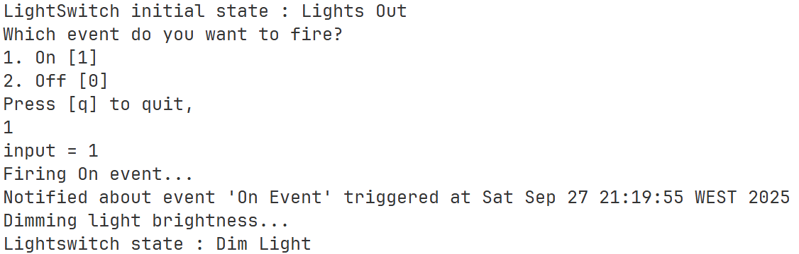

___

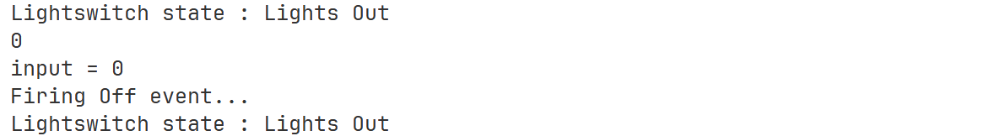

___

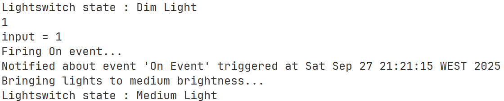

___

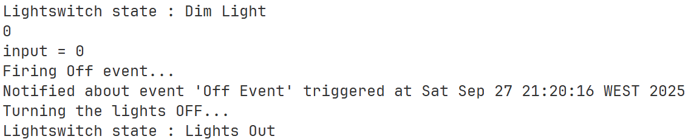

___

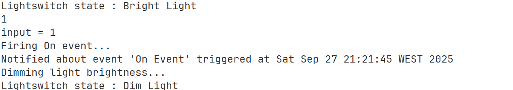

### Moore Light Switch FSM
Moore Light Switch FSM has the same architecture and differs in the follow aspects from Mealy FSM:

**MooreState.java** Following the same approach as in the turnstile example, we maintained this class to extend State class and overriding getOutput() to return its output, making this more dynamic and maintainable.
```java
public class MooreState extends State {
    private final String output;

    public MooreState(String name, String output) {
        super(name);
        this.output = Objects.requireNonNull(output, "Output cannot be null");
    }

    public String getOutput() {
        return output;
    }

    @Override
    public String toString() {
        return super.toString() + ", output='" + output + "'}";
    }
}
```


In the **LightSwitch.java** using the **Moore** state machine:
- Add the Output in the **MooreState**
- Adopted the new approach using **"new MooreState"**
- Removed the eventHandler from each Transition
- Added logs in order to verify the respective output of the state
```java
class Launcher {
    public static void main(String[] args) throws FiniteStateMachineException {

        State off = new MooreState("brightnessOut", "Lights Out");
        State dim = new MooreState("brightnessDim", "Dim Light");
        State med = new MooreState("brightnessMedium", "Medium Light");
        State high = new MooreState("brightnessBright", "Bright Light");

        Set<State> states = new HashSet<>();
        states.add(off);
        states.add(med);
        states.add(dim);
        states.add(high);
    
    ...

    Transition pressOnWhenOff = new TransitionBuilder()
            .name("Off to Dim")
            .sourceState(off)
            .eventType(OnEvent.class)
            .targetState(dim)
            .build();
    
    Transition pressOffWhenOff = new TransitionBuilder()
            .name("Off to Off")
            .sourceState(off)
            .eventType(OffEvent.class)
            .targetState(off)
            .build();
    
    Transition pressOnWhenDim = new TransitionBuilder()
            .name("Dim to Medium")
            .sourceState(dim)
            .eventType(OnEvent.class)
            .targetState(med)
            .build();
    
    Transition pressOffWhenDim = new TransitionBuilder()
            .name("Dim to Off")
            .sourceState(dim)
            .eventType(OffEvent.class)
            .targetState(off)
            .build();
    
    Transition pressOnWhenMedium = new TransitionBuilder()
            .name("Medium to High")
            .sourceState(med)
            .eventType(OnEvent.class)
            .targetState(high)
            .build();
    
    Transition pressOffWhenMedium = new TransitionBuilder()
            .name("Medium to Off")
            .sourceState(med)
            .eventType(OffEvent.class)
            .targetState(off)
            .build();
    
    Transition pressOnWhenBright = new TransitionBuilder()
            .name("High to Dim")
            .sourceState(high)
            .eventType(OnEvent.class)
            .targetState(dim)
            .build();
    
    Transition pressOffWhenBright = new TransitionBuilder()
            .name("High to Off")
            .sourceState(high)
            .eventType(OffEvent.class)
            .targetState(off)
            .build();
    ...

    System.out.println("Turnstile output : " + lightswitchStateMachine.getCurrentState().getOutput());

    ...
    }
}   
```

The following images demonstrate the Moore FSM working.

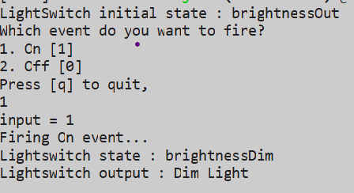

___

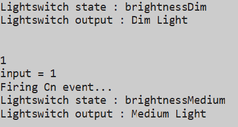

___

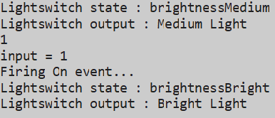

___

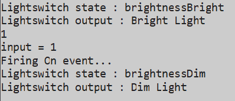

___

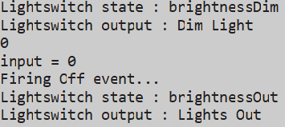

## Solution Alternative(s)
Another alternative solution would be to use a model checking tool such as NuSMV to model and verify the FSM behavior. 
Finite State Machines (FSM) in NuSMV support breaking the system description into modules, which improves readability and facilitates verification of interactions. 
Instead of implementing Moore and Mealy machines through object-oriented classes, we could describe the states, transitions and outputs using this formal specification language.
Using NuSMV offers advantages over Moore or Mealy implementations in code, allows automatic verification of logical properties, ensures formal correctness before actual implementation, and its modular structure also enhances readability and the analysis of component interactions. 
While Moore/Mealy machines focus on execution, NuSMV emphasizes formal validation and behavioral verification of the system.

## Alternative Implementation(s)
During development, MooreStates were implemented through the inheritance of the State class, which became an abstraction of what a state should be.
This allows for more flexible code, since future FSMs implementations may require new state types, easily implemented by extending the already existing State class.
It was also possible to simply add an output attribute to the State class, code a different constructor and use the same class for instantiating both Mealy and Moore states. However, this affects code readability and makes the code very stiff and highly coupled, becoming difficult to maintain, hence the actual implementation.

FSMs can have different types beyond Moore and Mealy.
This project could also have implemented it using the Harel approach, which could easily be implemented given the design patterns applied during development.

## Final Observations and Critical Reflection
**Moore** and **Mealy** state machines differ mainly in output generation, where Mealy outputs depend on both the current 
state and event input, while Moore outputs depend only on the state itself. 

Mealy can react immediately to events but requires managing more transition actions, the output changes as the input differs. 
Moore is simpler and more predictable, with outputs inside the states, with the downside of sometimes requiring more states to 
match Mealy behavior. 

Choosing between them depends on whether outputs are naturally associated with states or transitions, balancing clarity and responsiveness.

## Member Contributors Description
### 1221063 - Pedro Pires

- Evaluate the project regarding design and coding best practices  
- Evaluate if the project supports Mealy State Machines. If not, try to update the project to support it  
- Use the project to create a Mealey state machine for the light switch example  
- Analyse the unit tests of the project and, if necessary, add more tests to improve coverage  
- Report your work in the readme file of the repository

### 1221818 - Ângelo Oliveira

- Evaluate the project regarding design and coding best practices  
- Evaluate if the project supports Moore State Machines. If not, try to update the project to support it  
- Use the project to create a Moore state machine for the light switch example  
- Analyse the unit tests of the project and, if necessary, add more tests to improve coverage  
- Report your work in the readme file of the repository