# RAMDE: Assignment 2 - Report

## Introduction
This assignment was done in the scope of the RAMDE course, which is part of the MESCC master's degree lectured at Instituto Superior de Engenharia do Porto (ISEP).

The current assigment aims to model a Vehicle Climate Control System (VCCS) using model-based engineering tools, being the two main objectives, modeling the problem and modeling the solution. To model the problem was used the book “A Practical Guide to Systems Modeling with Papyrus and SysML”, and to model the solution was used the book “MagicGrid Book of Knowledge - A Practical Guide to Systems Modeling using MagicGrid from Dassault Systèmes”.

Modeling enables clear and well structured representations that ensure all stakeholders understand system’s functionality and objectives. This was achived using Systems Modeling Language (SysML), by Papyrus environment in Eclipse.

This repository holds the work of 2 students:

| Student         | Number  | Email               | Github                     |
|-----------------|---------|---------------------|----------------------------|
| Pedro Pires     | 1221063 | 1221063@isep.ipp.pt | https://github.com/Pireza  |
| Ângelo Oliveira | 1221818 | 1221818@isep.ipp.pt | https://github.com/1221818 |

## Problem
The goal of this project is to develop an efficient, safe, and reliable model of a Vehicle Climate Control System (VCCS), where it's required a system capable of maintaining a comfortable temperature in the vehicle by operating in both heating and cooling modes.

## Requirements for the Assignment

### Problem Modeling
Follow the Papytrus tutorial “A Practical Guide to Systems Modeling with Papyrus and SysML”:
- Capturing stakeholder needs in a Requirements Table.
- Model the System Context using a Use Case Diagram.
- Model the behavior of a Use Case with an Activity Diagram.
- Creating an Internal Block Diagram.
- Capturing Measures of Effectiveness (MoE).

### Solution Modeling
Follow the “MagicGrid Book of Knowledge – A Practical Guide to Systems Modeling using MagicGrid from Dassault Systèmes”, here the focus is the "Solution Domain" chapter:
- Create System Requirements
- Relate System Requirements and Stakeholder Needs
- Create a System High Level Architecture
- Model Subsystem Requirements
- Model Subsystem Structure
- Model Subsystem Behaviour (with State Machines)
- Model Subsystem Parameters

Explore possible modeling alternatives for previous tasks.

Read the "Annex A: Safety & Reliability Analysis" and elaborate a theoretical Safety and Reliability analysis.

## Solution Implementation

### Problem Modeling
In the Problem Modeling only the Black Box is carried out, where the stakeholder needs were captured and defined the system context. Subsequently, the stakeholders needs were analyzed, the main use cases mapped, and the interactions between different parts of the system are analysed to understand how they collaborate.

**Stakeholders Needs**   
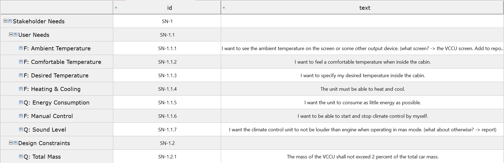

**System Context**   
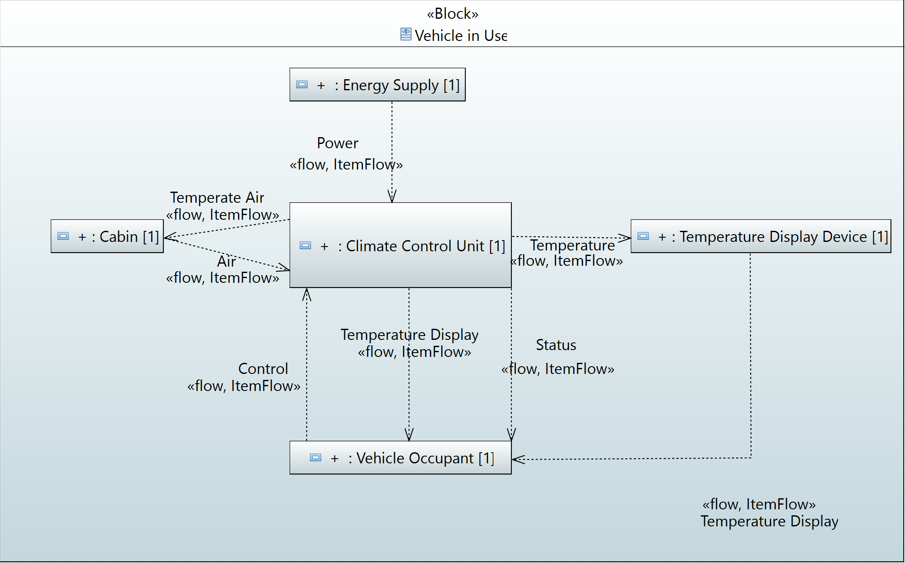

**Use cases**   
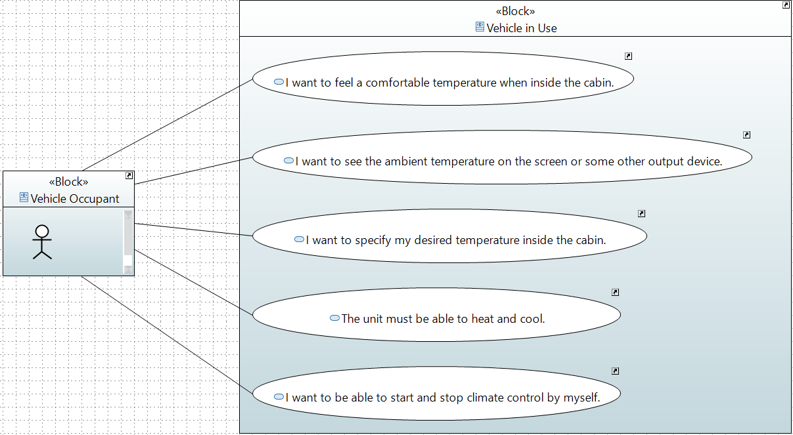

**Comfortable Temperature**   
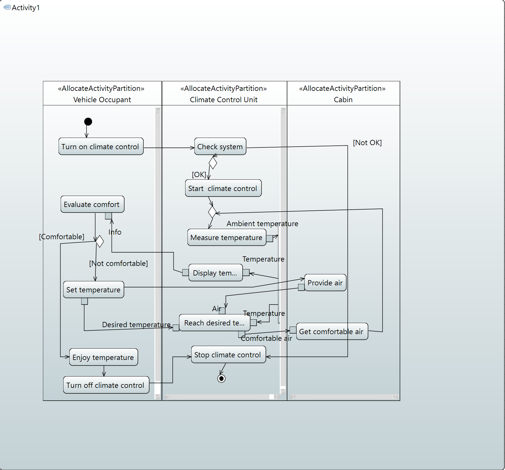

**Ambient Temperature**   
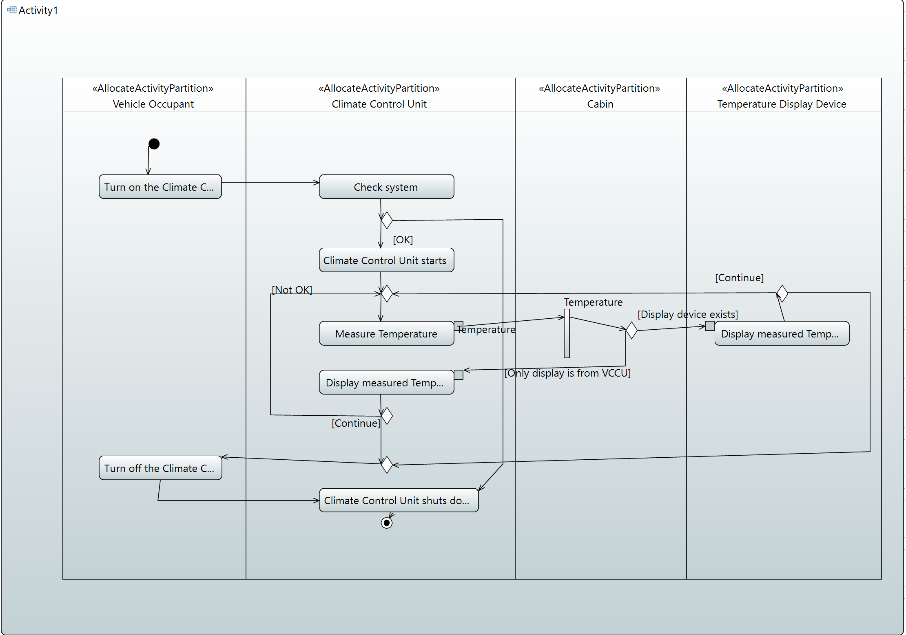

**Desired Temperature**   
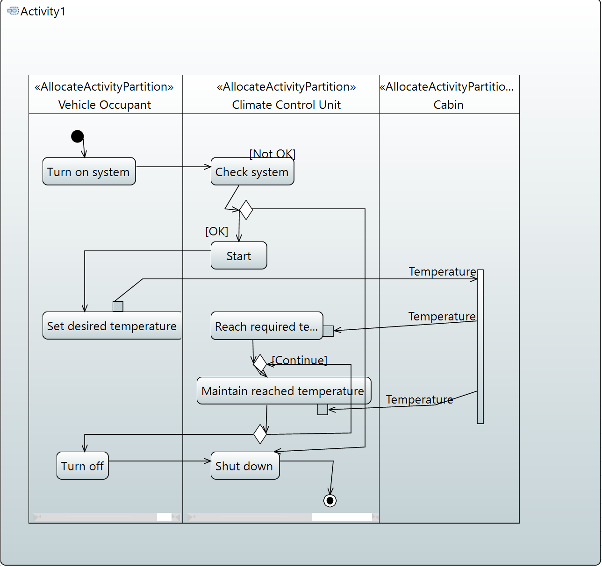

**Measures of Effectiveness (MoE)**    
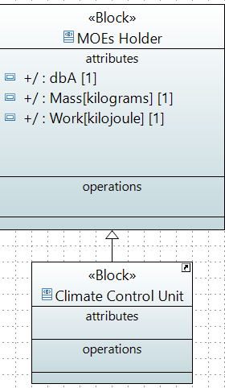

**Types**    
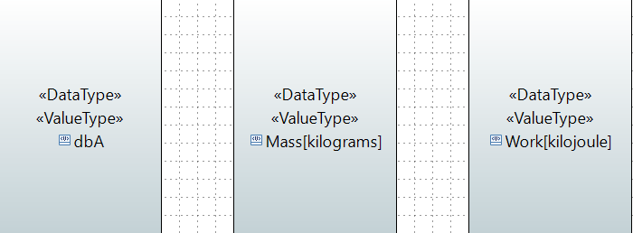

### Solution Modeling
Once the problem has been modeled, the next step is the solution modeling. In the phase the system is modeled to focus on defining how the system will meet the identified requirements, ensuring that the proposed solution is coherent, implementable, and aligned with stakeholder needs.

**System Requirements**     

**From System Requirements to Stakeholders Needs**   
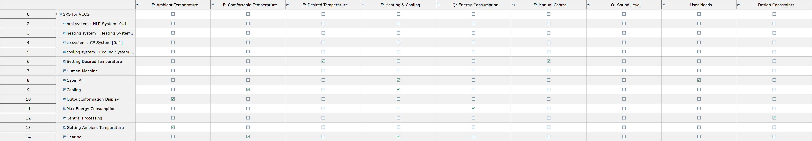

**High Level Architecture**    
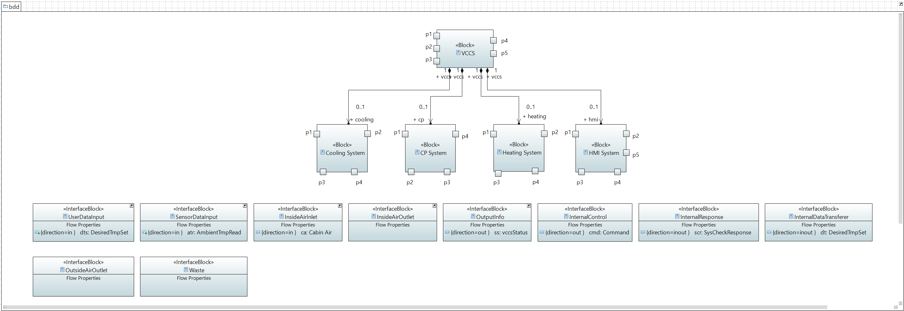
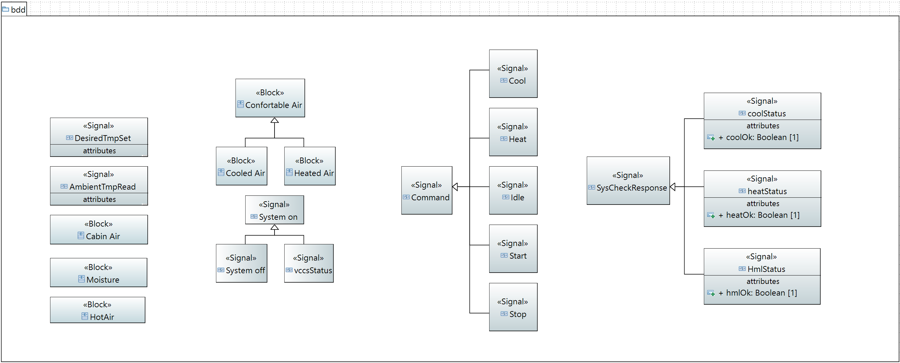

**Communications between CP and Cooling System**     
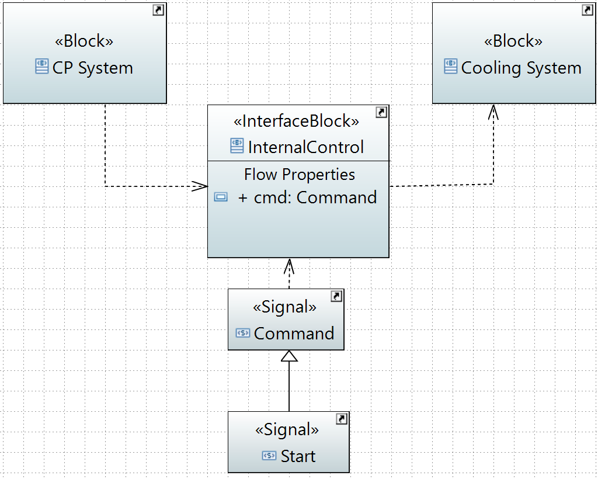 

**Behaviour of the system using states**      
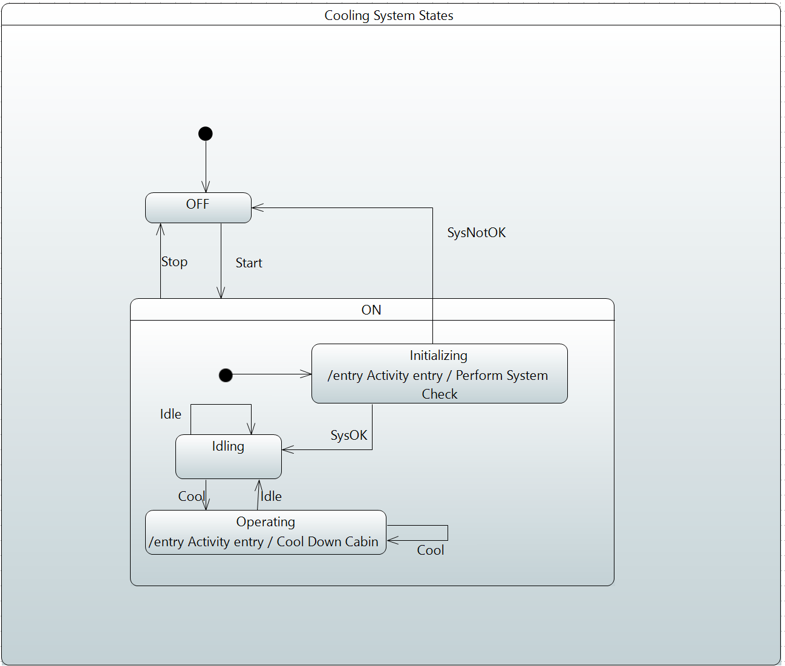

**System Parameters**   
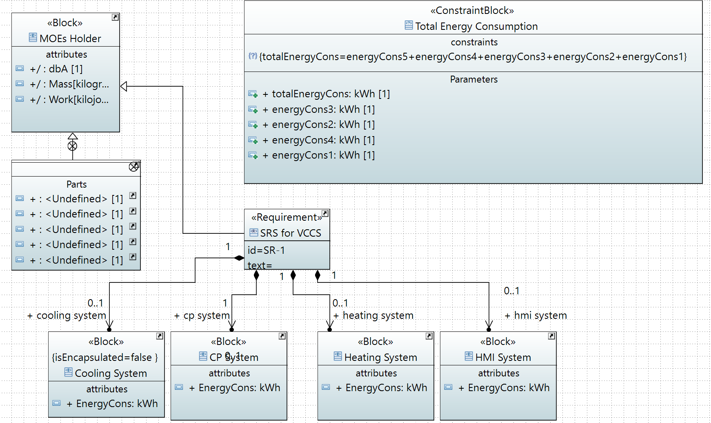

**Subsystem requirements**   
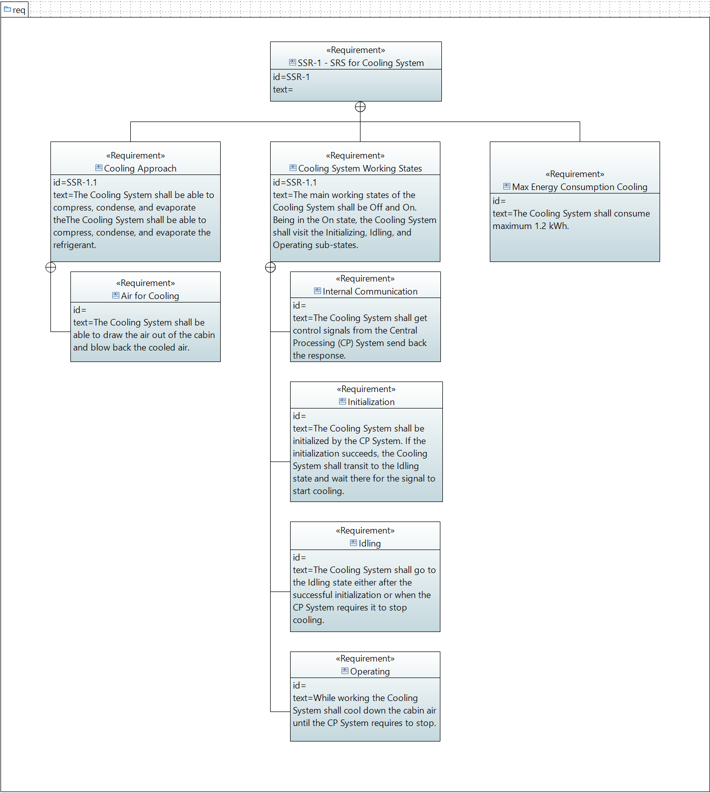

**Subsystem Architecture**   
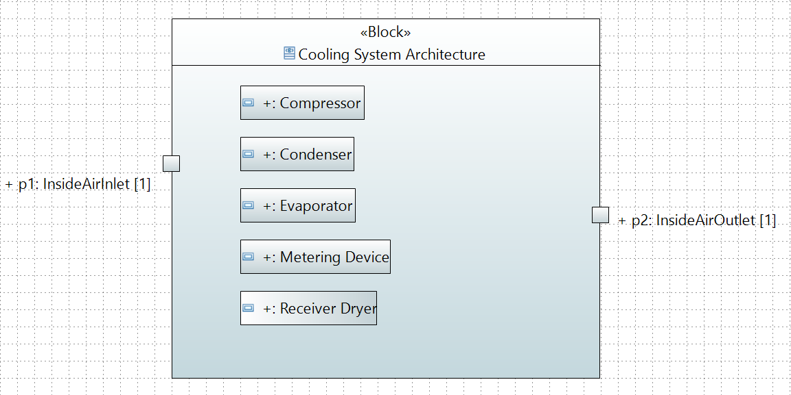

**Subsystem Structure**   
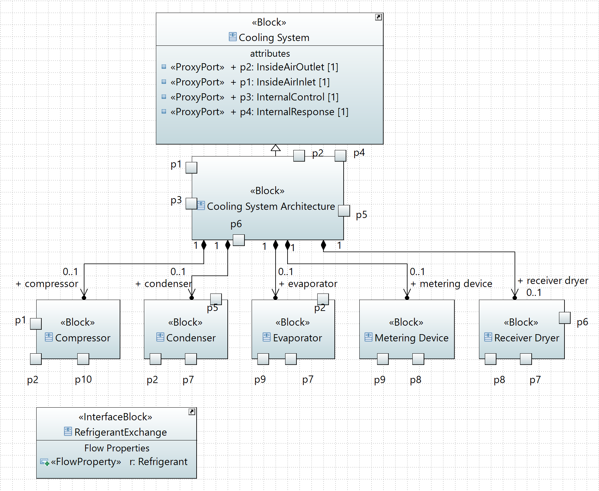
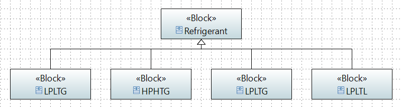

**From Subsystem requirements to System Requirements and LSA**   

## Annex A: Safety & Reliability Analysis
Safety and reliability are critical for the VCCU system. The system must operate consistently without exposing passengers to risks. This analysis follows the standards IEC 61508, IEC 60812, and ISO/IEC 2382, and applies Failure Mode and Effects Analysis (FMEA) to reduce failures by introducing targeted safety and reliability requirements.

### 1. Stakeholder Safety and Reliability Requirements   

Two main categories of requirements are considered:
1. **Functional Performance**: Desired cabin temperature within an acceptable time.    
2. **Safety of Passengers**: Avoiding hazardous due to system failure.   

System requirements are being captured using SysML, enabling traceability between stakeholder needs and the system design. 

### 2. Conceptual FMEA
The system is analyzed without considering internal details, and each potential failure is evaluated in terms of:
- Failure cause
- Failure mode
- Local and system-level effects
- Mitigation

An example of this is a failure when circulating air, that can result in overheating or undercooling. And it's possible to mitigate by providing a fail-safe shutdown requirement.

### 3. Functional FMEA
Evaluates failure modes in behaviors of the system, like system flows or use cases, and it's able to give more detailed analysis about potencial failures. Such as Provide Comfortable Temperature where it has a very good evaluation of the involved risks. 

Two **Mitigation strategies** presented is the Automatically shutting the system down in fail-safe mode and also Limp More activation if the system have a failure and stop sending messaged to the user.

These safety requirements will be in the diagrams and functional descriptions, ensuring that all flows respect safety and reliability constraints.

### 4. FMEA (White Box) Analysis
Functional and conceptual FMEA must also be performed at the White Box view. It results in modifications to the system model, such as the Test Air Flow function, which verifies incoming airflow and addresses newly introduced safety requirements, and each identified failure needs mitigation requirements.

### 5. Iterative Verification and Traceability
All safety and reliability requirements are reflected in the entire system, verified and traced to stakeholder needs. 
This ensures that potencial failures are covered, mitigation requirements are clear and in place, and the architecure supports safety and reliability under any conditions.

## Final Observations and Critical Reflection
This implementation successfully reinforced the importance of modeling to achive a safe and clear systems. Throughout the project we learned tools such as Eclipse and Papyrus that support us to create use cases and activity diagrams, translating stakeholder requirements into detailed and comprehensible models. It has also facilitated the identification of requirements, the organization of subsystems, analysis of interactions, and potential failures.

## Member Contributions Description 
The work was done together throughout the entire assigment, where both team members contributed equally to all phases of the project participating in discussions, decisions, and validation of the final results. 
### Student 1: 1221063 - Pedro Pires
### Student 2: 1221818 - Ângelo Oliveira
