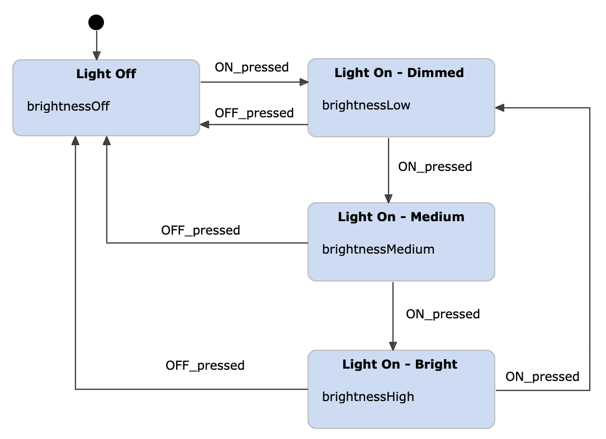
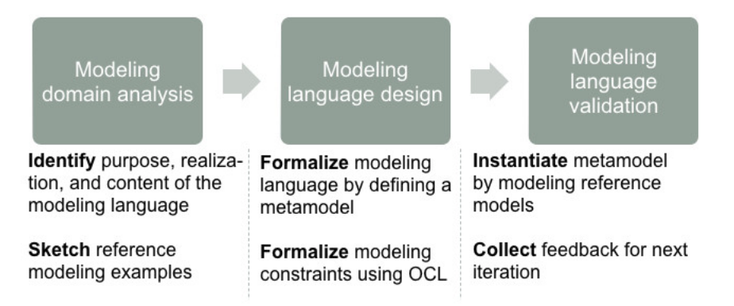
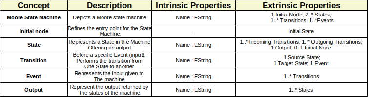
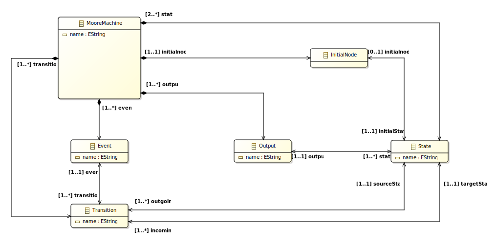
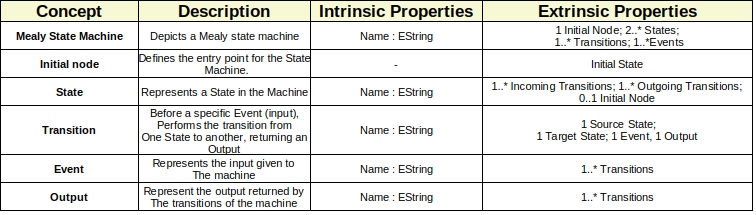
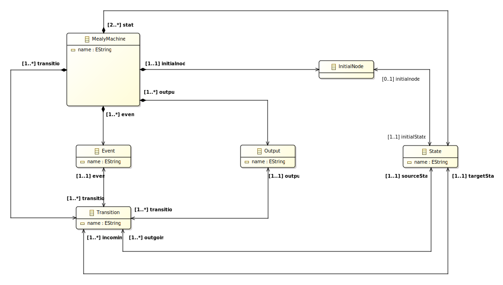

# RAMDE: Assignment 3 - Report

## Introduction

This assignment was done in the scope of the RAMDE course, which is part of the Engenharia de Sistemas Computacionais Críticos, or MESC, master's degree lectured at Instituto Superior de Engenharia do Porto (ISEP).

The RAMDE course consists on teaching model-oriented engineering applied to critical systems, focusing on the software development process which involves requirement analysis, using validation/verification tools based on models and application testing.

This repository holds the work of 2 students:

| Student         | Number  | Email               | Github                     |
|-----------------|---------|---------------------|----------------------------|
| Pedro Pires     | 1221063 | 1221063@isep.ipp.pt | https://github.com/Pireza  |
| Ângelo Oliveira | 1221818 | 1221818@isep.ipp.pt | https://github.com/1221818 |

## Problem

This assignment focuses on **Domain-Specific Languages**. A **Domain-Specific Language**, or **DSL** for short, is a language designed to create models for a specific context or domain.

In model-driven engineering, the DSL serves as a **Metamodel** that defines elements/constraints/rules for the creation of real-world objects, called **Models**, that meet specific criteria under a certain business domain/context.
 
In contrast, a **GPML**, **General Purpose Modelling Language**, such as **UML**, can be applied to any sector, under any software modelling context.
**UML**, for an example, allows for **Class Diagrams**, **Component Diagrams**, **State Machine Diagrams**, etc...
Despite this plethora of modelling options, UML may be inadequate **under specific domain constraints**, though generic in nature.

This assignment targets one such **specific domain**, regarding **Mealy** and **Moore** state machines. UML does, in fact, already support **State Machine** modelling capabilities, as previously stated. However, GPMLs are inappropriate to efficiently model State Machines under this context, for mainly two reasons:

- **GPMLs are excessive -** This problem's domain revolves around State Machines, and State Machines only. There is no need for a language that supports Class Diagrams or Activity Diagrams when a business just needs tools for State Machine modelling.


- **General doesn't mean Universal -** Under domain-specific constraints, the tools provided by a GPML may be insatisfactory. **For an example**, my business logic may impose that the name of each State in a Machine can't contain special symbols. That imposition may not be respected by a GPML, due to it being **generic**. Utilising DSLs allows for establishing those State Machine modelling rules and logic, **ensuring their utmost validity under specific domain constraints**.

The following subsection is a brief theorical introduction to Mealy and Moore machines, the differences between them and their unique characteristics, which helped shape the different DSLs for modelling both types of State Machines.

### Moore and Mealy State Machines

**State Machines** can be defined as follows:

> A state machine is a **behaviour model**. It consists of a finite number of states and is therefore also called **finite-state machine** (FSM). Based on the current state and a given input the machine performs state transitions and produces outputs.

The basic building blocks of a state machine are **states** and **transitions**.

A **state** is a situation in the system that depends on previous inputs and causes a reaction on following inputs. The FSM can change from one state to another, based on a specific input that it is given, and this is called a **transition**.

Depending on the output producing agent, which can be either the state or the transition itself, there can be different FSMs types.


In **Moore machines the output is determined solely by the current state, not by any input**. The picture below illustrates an **adjustable light** Moore State Machine as an example. 



___


On the other hand, **Mealy machines produce outputs only on transitions and not in states**. This often results in state diagrams with fewer states because more logic can be put on transitions. The picture below illustrates the previous example following a Mealy approach.


 

## Requirements for the Assignment

The requirements for this assignment are listed below:

- **Create a metamodel/DSL for Moore state machines**
	- Create some state machine models using the dynamic instances option
	- Create some state machine models using a modelling environment created using the genmodel option
	
	
- **Create a metamodel/DSL for Mealy state machines**
	- Create some state machine models using the dynamic instances option
	- Create some state machine models using a modelling environment created using the genmodel option

- **Enrich the two previously developed metamodels with OCL constraints** to avoid, as much as possible, the possibility of building invalid state machine models

|**ID**| **OCL Constraint specification**  																	|
|------|----------------------------------------------------------------------------------------------------|
|1.    |Names must not be empty																			    |
|2.    |Names must have at least 3 characters															    |
|3.    |Names must start with uppercase																	    |
|4.    |Names must be unique																			    |
|5.    |All States should be the target of at least one transition										    |
|6.    |There is one and only one state marked as the initial state										    |
|7.    |**States should be source of at least one transition**											    |
|8.    |**Names should not contain special symbols**														|
|9.    |**Names should not contain numbers**																|
|10.   |**Two transitions shouldn't have the same source and event, otherwise they are the same transition**|
|11.   |**Names should not be longer than 15 characters**                                                   |


## Solution Design

The solution design for DSLs that support Mealy and Moore machines followed a set of principles:

- Must provide good abstractions to the developer, must be intuitive, and make life easier, not harder

- Must not depend on one-man expertise for its adoption and usage since its definition must be shared and agreed upon

- Must evolve and must be kept updated based on the user and context needs, otherwise it is doomed to die

- Must come together with supporting tools and methods Should be open for extensions and closed for modifications (open-close principle)


It is also important to mention that, as Models follow the guidelines of Metamodels, Metamodels also follow the rules/constraints established by their Metamodels, these last ones being called **Meta-Metamodels**. These **Meta-Metamodels** are based on the core Object-Oriented structural concepts, such as **Class Diagrams** and **Associations**.

One such widely accepted Meta-Metamodel, which is used for this solution, is the **Meta-Object Family**, or **MOF** for short. Nonetheless, the **MOF** is not sufficent (in most cases) to fully express a business' constraints and rules. 

These additional specific constraints could be specified in natural language or, **even more sophisticated and less prone to ambiguity**, using a **formal specification language**, such as **OCL** (used in this solution's design).

**OCL** can be used on models to describe expressions, specifying **invariant conditions that need to be met** in order to accept a model's validity.

___

The process followed to develop the DSLs can be summarised by the picture below.



### Moore Design

Below are identified the modeling concepts for a **Moore** state machine.


___

The following picture depicts the Metamodel defined by the previously established modeling concepts.



___

To prove validation of the developed Metamodel, 2 **dynamic instances** of the metamodel and 2 models generated using the **editor** defined by the DSL were created. They can be found under ``assignment3/dslmoore/model`` and ``assignment3/mooreproject`` respectively.
The metamodel was used to model the Moore state machines depicted in the following images.
 
___


___


___


___


___


### Mealy Design

Below are identified the modeling concepts for a **Mealy** state machine.



___

The following picture depicts the Metamodel defined by the previously established modeling concepts.



___

To prove validation of the developed Metamodel, 2 **dynamic instances** of the metamodel and 2 models generated using the **editor** defined by the DSL were created. They can be found under ``assignment3/dslmealy/model`` and ``assignment3/mealyproject`` respectively.
The metamodel was used to model the Mealy state machines depicted in the following images.

___


___


___


___


___


## Solution Implementation

The OCL constraints described in the [requirements section](#requirements-for-the-assignment) were implemented in the same way for both Moore and Mealy Metamodels. They are as follows:

- **Moore/MealyStateMachine Class**
	
	- **onlyOneStateMachinePerDiagramIsAllowed** - This constraint enforces only one state machine per project, ensuring that the machine's name is unique. Also, it ensures each project to contain a machine, failing validation when it is missing one.
		```ocl
		[Mealy|Moore]Machine.allInstances() -> size() = 1;
		```
	- **statesNamesShouldBeUnique** - Ensures every State in the machine has a unique name.
		```ocl
		self.state -> forAll(s1, s2 | s1 <> s2 implies s1.name.trim().equalsIgnoreCase(s2.name.trim()) = false);
		```
	- **transitionsNamesShouldBeUnique** - Ensures every Transition in the machine has a unique name.
		```ocl
		transition -> forAll(t1, t2 | t1 <> t2 implies t1.name.trim().equalsIgnoreCase(t2.name.trim()) = false);
		```
	- **outputNamesShouldBeUnique** - Ensures every Output in the machine has a unique name.
		```ocl
		self.output -> forAll(o1, o2 | o1 <> o2 implies o1.name.trim().equalsIgnoreCase(o2.name.trim()) = false);
		```
	- **eventNamesShouldBeUnique** - Ensures every Event in the machine has a unique name.
		```ocl
		self.event -> forAll(e1, e2 | e1 <> e2 implies e1.name.trim().equalsIgnoreCase(e2.name.trim()) = false);
		```
	- **twoTransitionsShouldNotTakeTheSameSourceAndEvent** - Prevents the creation of two transitions that have the same source State and act upon the same Event. In principle, transitions with the same source State that act on the same Event should be the same Transition. This constraint ensures that the user doesn't create ambiguous transitions, providing safe State Machine modelling.
		```ocl
		self.transition -> forAll(t1, t2 | (t1 <> t2 and t1.event = t2.event implies t1.sourceState <> t2.sourceState) or (t1 <> t2 and t1.sourceState = t2.sourceState implies t1.event <> t2.event));
		```
	- **machineNameMustHaveAtLeastThreeCharactersExcludingRepeatingEmptySpaces** - Machine name should have a length of at least 3 characters. This also ensures the name isn't empty. Trim function was used to prevent users from inputting empty spaces or tabs to bypass the length requirements.
		```ocl
        self.name.trim().size() >= 3;
        ```		
	- **machineNameMustStartWithUppercase** - Machine name should start with an uppercase character.
		```ocl
        self.name.trim().substring(1, 1).toUpper().compareTo(self.name.trim().substring(1, 1)) = 0;
        ```
	- **nameMustHaveThirtyCharactersAtMax** - Machine name should have a maximum lenght of 30 characters.
		```ocl
        self.name.trim().size() <= 30;
        ```
	- **nameShouldNotContainSpecialCharacters** - Machine name shouldn't contain special characters.
		```ocl
        self.name.characters()->forAll(c | '\\|!"@#£$§%&/{[]=}?\'»«+*¨`´~^.:,;'.indexOf(c) = 0);
        ```
	- **nameShouldNotContainNumbers** - Machine name shouldn't contain numbers.
		```ocl
        self.name.characters()->forAll(c | '0123456789'.indexOf(c) = 0);
        ```


- **InitialNode Class**

	- No additional invariants were added here. The sole purpose of this Class is to denote which State is the initial one.

- **State Class**


	- **stateShouldBeTheTargetOfAtLeastOneTransition** - Every state should have at least one incoming transition, to prevent unreachable states. This is already defined by the DSL, with the cardinality, but the OCL constraint reinforces it.
		```ocl
		self.incoming -> size() >= 1;
		```
	- **stateShouldBeTheSourceOfAtLeastOneTransition** - Every state should have at least one outgoing transition, to prevent dead ends. This is already defined by the DSL, with the cardinality, but the OCL constraint reinforces it.
		```ocl
		self.outgoing -> size() >= 1;
		```
	- **stateNameMustHaveAtLeastThreeCharactersExcludingRepeatingEmptySpaces** - State name should have a length of at least 3 characters. This also ensures the name isn't empty. Trim function was used to prevent users from inputting empty spaces or tabs to bypass the length requirements.
		```ocl
        self.name.trim().size() >= 3;
        ```		
	- **stateNameMustStartWithUppercase** - State name should start with an uppercase character.
		```ocl
        self.name.trim().substring(1, 1).toUpper().compareTo(self.name.trim().substring(1, 1)) = 0;
        ```
	- **nameMustHaveThirtyCharactersAtMax** - State name should have a maximum lenght of 30 characters.
		```ocl
        self.name.trim().size() <= 30;
        ```
	- **nameShouldNotContainSpecialCharacters** - State name shouldn't contain special characters.
		```ocl
        self.name.characters()->forAll(c | '\\|!"@#£$§%&/{[]=}?\'»«+*¨`´~^.:,;'.indexOf(c) = 0);
        ```
	- **nameShouldNotContainNumbers** - State name shouldn't contain numbers.
		```ocl
        self.name.characters()->forAll(c | '0123456789'.indexOf(c) = 0);
        ```


- **Transition Class**

	- **transitionNameMustHaveAtLeastThreeCharactersExcludingRepeatingEmptySpaces** - Transition name should have a length of at least 3 characters. This also ensures the name isn't empty. Trim function was used to prevent users from inputting empty spaces or tabs to bypass the length requirements.
		```ocl
        self.name.trim().size() >= 3;
        ```		
	- **transitionNameMustStartWithUppercase** - Transition name should start with an uppercase character.
		```ocl
        self.name.trim().substring(1, 1).toUpper().compareTo(self.name.trim().substring(1, 1)) = 0;
        ```
	- **nameMustHaveThirtyCharactersAtMax** - Transition name should have a maximum lenght of 30 characters.
		```ocl
        self.name.trim().size() <= 30;
        ```
	- **nameShouldNotContainSpecialCharacters** - Transition name shouldn't contain special characters.
		```ocl
        self.name.characters()->forAll(c | '\\|!"@#£$§%&/{[]=}?\'»«+*¨`´~^.:,;'.indexOf(c) = 0);
        ```
	- **nameShouldNotContainNumbers** - Transition name shouldn't contain numbers.
		```ocl
        self.name.characters()->forAll(c | '0123456789'.indexOf(c) = 0);
        ```

- **Event Class**

	- **eventNameMustHaveAtLeastThreeCharactersExcludingRepeatingEmptySpaces** - Event name should have a length of at least 3 characters. This also ensures the name isn't empty. Trim function was used to prevent users from inputting empty spaces or tabs to bypass the length requirements.
		```ocl
        self.name.trim().size() >= 3;
        ```		
	- **eventNameMustStartWithUppercase** - Event name should start with an uppercase character.
		```ocl
        self.name.trim().substring(1, 1).toUpper().compareTo(self.name.trim().substring(1, 1)) = 0;
        ```
	- **nameMustHaveThirtyCharactersAtMax** - Event name should have a maximum lenght of 30 characters.
		```ocl
        self.name.trim().size() <= 30;
        ```
	- **nameShouldNotContainSpecialCharacters** - Event name shouldn't contain special characters.
		```ocl
        self.name.characters()->forAll(c | '\\|!"@#£$§%&/{[]=}?\'»«+*¨`´~^.:,;'.indexOf(c) = 0);
        ```
	- **nameShouldNotContainNumbers** - Event name shouldn't contain numbers.
		```ocl
        self.name.characters()->forAll(c | '0123456789'.indexOf(c) = 0);
        ```

- **Output Class**

	- **outputNameMustHaveAtLeastThreeCharactersExcludingRepeatingEmptySpaces** - Output name should have a length of at least 3 characters. This also ensures the name isn't empty. Trim function was used to prevent users from inputting empty spaces or tabs to bypass the length requirements.
		```ocl
        self.name.trim().size() >= 3;
        ```		
	- **outputNameMustStartWithUppercase** - Output name should start with an uppercase character.
		```ocl
        self.name.trim().substring(1, 1).toUpper().compareTo(self.name.trim().substring(1, 1)) = 0;
        ```
	- **nameMustHaveThirtyCharactersAtMax** - Output name should have a maximum lenght of 30 characters.
		```ocl
        self.name.trim().size() <= 30;
        ```
	- **nameShouldNotContainSpecialCharacters** - Output name shouldn't contain special characters.
		```ocl
        self.name.characters()->forAll(c | '\\|!"@#£$§%&/{[]=}?\'»«+*¨`´~^.:,;'.indexOf(c) = 0);
        ```
	- **nameShouldNotContainNumbers** - Output name shouldn't contain numbers.
		```ocl
        self.name.characters()->forAll(c | '0123456789'.indexOf(c) = 0);
        ```


## Solution Alternative(s)

- **State Specialisation** - Instead of having a InitialNode Class that marks the entry point for the machine, an abstract class named **GenericState** could be instead used, and from there create specialisations for an **InitialState** and a normal **State**. This would obviously require new OCL constraints, but nothing to complicated. This would be a more OO approach.

## Alternative Implementation(s)

- **Invariant Redundacy** - The defined named constraints are repeated in all Classes. Abstraction could help reduce this unecessary repetion. For an instance if each class was a specialisation of a super Class **MachineComponent** the many invariants would be reduced to just one.

- **Isolated State Clusters Prevention** - A new, more complex, OCL constraint could be added to prevent creating a Machine with separated clusters of States. The way the DSL is designed currently allows for multiple unreachable separate clusters of States that meet all the other criteria. This could be done by means of **graph theory**, implementing path finding algorithms.

## Final Observations and Critical Reflection

The implementation for Moore and Mealy DSLs was helpful for understanding the differences between the two approaches for designing a state machine. Applying OCLs to add constraints to the metamodels was important to ensure data integrity, avoiding the creation of invalid models according to the established business logic.

The modelling of different types of state machines, using dynamic instances and the editor generated by the DSL, were helpful to ensure the established logic under the working domain was working according to expectations.

## Member Contributions Description 

### Student 1: 1221063 - Pedro Pires

- Moore Machine DSL definition
- OCL constraints definition

### Student 2: 1221818 - Ângelo Oliveira

- Mealy Machine DSL definition
- OCL constraints definition