# RAMDE: Assignment 4 - Report

## Introduction

This assignment was done in the scope of the RAMDE course, which is part of the Engenharia de Sistemas Computacionais Críticos, or MESC, master's degree lectured at Instituto Superior de Engenharia do Porto (ISEP).

The RAMDE course consists on teaching model-oriented engineering applied to critical systems, focusing on the software development process which involves requirement analysis, using validation/verification tools based on models and application testing.

This repository holds the work of 2 students:

| Student         | Number  | Email               | Github                     |
|-----------------|---------|---------------------|----------------------------|
| Pedro Pires     | 1221063 | 1221063@isep.ipp.pt | https://github.com/Pireza  |
| Ângelo Oliveira | 1221818 | 1221818@isep.ipp.pt | https://github.com/1221818 |

## Problem

This assignment focuses on generating text from pre-existing models.

Assignment 1's objective was to get familiar with the [**Easy States**](https://github.com/pafomaio/easy-states), as well as provide further implementation regarding Moore state machines. This library allows for the simple instantiation of State Machines as depicted in the snippet below.

```java
        State locked = new State("locked");
        State unlocked = new State("unlocked");

        Set<State> states = new HashSet<>();
        states.add(locked);
        states.add(unlocked);
        
        /*
         * Define FSM transitions
         */
        Transition unlock = new TransitionBuilder()
                .name("unlock")
                .sourceState(locked)
                .eventType(CoinEvent.class)
                .eventHandler(new Unlock())
                .targetState(unlocked)
                .build();

        Transition pushLocked = new TransitionBuilder()
                .name("pushLocked")
                .sourceState(locked)
                .eventType(PushEvent.class)
                .targetState(locked)
                .build();

        Transition lock = new TransitionBuilder()
                .name("lock")
                .sourceState(unlocked)
                .eventType(PushEvent.class)
                .eventHandler(new Lock())
                .targetState(locked)
                .build();

        Transition coinUnlocked = new TransitionBuilder()
                .name("coinUnlocked")
                .sourceState(unlocked)
                .eventType(CoinEvent.class)
                .targetState(unlocked)
                .build();

        /*
         * Build FSM instance
         */
        FiniteStateMachine turnstileStateMachine = new FiniteStateMachineBuilder(states, locked)
                .registerTransition(lock)
                .registerTransition(pushLocked)
                .registerTransition(unlock)
                .registerTransition(coinUnlocked)
                .build();
```

On the other hand, assignment 3 focused on creating a DSL that represented Moore/Mealy state machines, ensuring valid business logic.

Considering the scenario where users are assigned with using the **Easy States** library, it can be a nuisance and error-prone to use the framework directly, each time they need to create a new state machine. By making use of the defined metamodel, it is possible that state machine modelling is business correct, however for this use case scenario it is not enough, since the users need actual state machine implementation.

By using **Acceleo**, a pragmatic implementation of OMG **MOF Model to Text Language Standard**, it is possible for users to input dynamically created models of theirs, **according to the established metamodels**, and generate text files that match their needs. The objective is to allow for two types of text generation. The first one is **UML source generation**, since UML allows for creating State Diagrams, providing visual representations of the machines; the other is actual **runnable Java code** that uses the **Easy States** library, so automatic generation of code is done efficiently while respecting business logic.

## Requirements for the Assignment

The requirements for this assignment are listed below:

- **Create a project to execute transformations on Moore machine models expressed according to the DSL defined in assignment 3**
	- Generate a PlantUML source file depicting the model received as input
	- Generate executable Java code corresponding to the model received as input and that reuses the Easy-States library
	
	
- **Create a project to execute transformations on Mealy machine models expressed according to the DSL defined in assignment 3**
	- Generate a PlantUML source file depicting the model received as input
	- Generate executable Java code corresponding to the model received as input and that reuses the Easy-States library

- **Test the transformations for at least 3 different models**

## Solution Design

Each of the following sections will ecompass two subsections, regarding the UML and Java code generation portions of the assignment.

### UML Generation

To determine what the generated UML source file shall look like, an example UML state diagram was used.

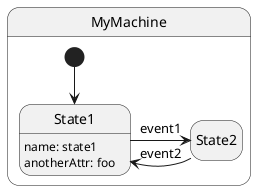

The previous UML source generates the following diagram.


The UML source depicts the following elements:

- **state [machineName] { ... } ** - Defines the Machine's name  and scope
- **[*]** - Defines the entry point of the state machine
- **[sourceStateName] -> [targetStateName] : [description]** - Defines a transition with a description
- **[stateName] : [description]** - Defines a state with a description

This will be the basis for the UML source generation. However, the way these elements were utilised demand further explaining:

- UML **doesn't allow for state names with spaces or dashes (-)**, which will be important when defining the transformations

- **There will be differences between Moore and Mealy transformations**
	- **For Moore machines**, states description will be used to highlight the output
	- On the other hand, **for Mealy machines**, transitions descriptions will be used to highlight the machine's outputs

This differences are comply with Moore and Mealy state machine definitions. Besides that, everything else will remain similar between the two types, such as transitions' descriptions highlighting the event that fires the switch from one state to another.

### Java Code Generation


## Solution Implementation

### UML 

Both Moore and Mealy machines UML transformations have some common aspects that  are addressed below:

- **Correct UML file format** - The **.puml** file extension was appended to the file name, which is the name of the state machine
- **Basic UML structure** - UML source files declare their elements between the directives **@startuml** and **@enduml**
- **Reasonable font size** - The default font size used in state diagrams was enlarged to facilitate reading, by means of the **skinparam stateFontSize [int]** directive 
- **Artifact clutter avoidance** - To prevent difficult reading of the diagrams, the directive **hide empty description** was used to hide elements without a description


Some of these common aspects were implemented using queries, that allows for easy reading of the transformation source code but encapsulating complex instructions under a callable function.

This means both transformations have a structure as follows:

```
[template public generateUML(machine : Machine)]
[comment @main/]
[file (machine.fileName(), false, 'UTF-8')] [comment File name and extension definition/]
@startuml                                       [comment Basic UML structure/]
skinparam stateFontSize 14                      [comment Reasonable font size/]
hide empty description                          [comment Artifact clutter avoidance/]
{State diagram elements}                        [comment Actual state diagram definition/]
@enduml                                         [comment Basic UML structure/]
[/file]
[/template]

[comment All queries below regard returning names without spaces or dashes, as per UML specifications /]

[query protected machineName(m : Machine) : String = m.name.replaceAll(' ', '').replaceAll('-', '')/]
[query protected stateName(s : State) : String = s.name.replaceAll(' ', '').replaceAll('-', '') /]
[query protected getInitialState(m: Machine): State = m.initialnode.initialState /]
[query protected fileName(m : Machine) : String = m.name.replaceAll(' ', '').replaceAll('-', '') + '.puml' /]
```

#### Moore

The following snippet regards the state diagram elements definition in Moore transformation.

```
state [aMooreMachine.machineName() /] {

	['[' + '*' + ']'/] ---> [aMooreMachine.getInitialState().stateName() /]

	[for (transition : Transition | aMooreMachine.transition) separator('\n')]
	[transition.sourceState.stateName()/] ---> [transition.targetState.stateName()/] : **Event**: [transition.event.name/]
	[/for]

	[for (state: State | aMooreMachine.state) separator('\n')]
	[state.stateName() /] : **Output**: [state.output.name /]
	[/for]

}
```

**1.** The most common aspect found in the snippet is the usage of `replaceAll(' ', '').replaceAll('-', '')` queries when defining elements' names. This was mentioned in a previous section where UML state diagrams don't accept names with spaces or dashes. Here they are removed and replaced by empty spaces, following a Pascal case typing. This is also present in Mealy transformation

**2.** The state diagram name is defined using `state [aMooreMachine.machineName() /] { ... }` expression. This is also present in Mealy transformation

**3.** The initial state is defined right at the beginning with `['[' + '*' + ']'/] ---> [aMooreMachine.getInitialState().stateName() /]` through a simple fetch of the machine's initial node and the state associated with it. This is also present in Mealy transformation

**4.** There is a **for** loop that iterates over every transition and adds a new line after processing it. This processing will consist in:
	- Writing the source state name first
	- Writing a '--->' arrow
	- Writing the target state name third
	- Writing a ':' followed by the expression '**Event**: ' and ending on the name of the event that fired the transition
	
**5.** There is one more **for** loop that iterates over every state and adds a new line after processing it. This processing simply writes the name of the state, followed by ':' and then the expression '**Output**: ', after which the state's output is evidenced

The previous transformation was used to generate UML source for 3 previously instantiated, in assignment 3, models of Moore machines: **1. Adjustable Light**, **2. Binary Parser** and **3. Turnstile**.


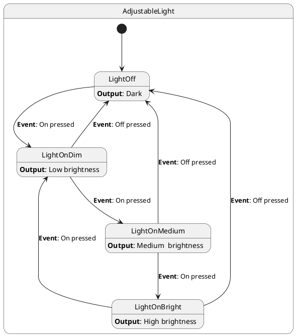

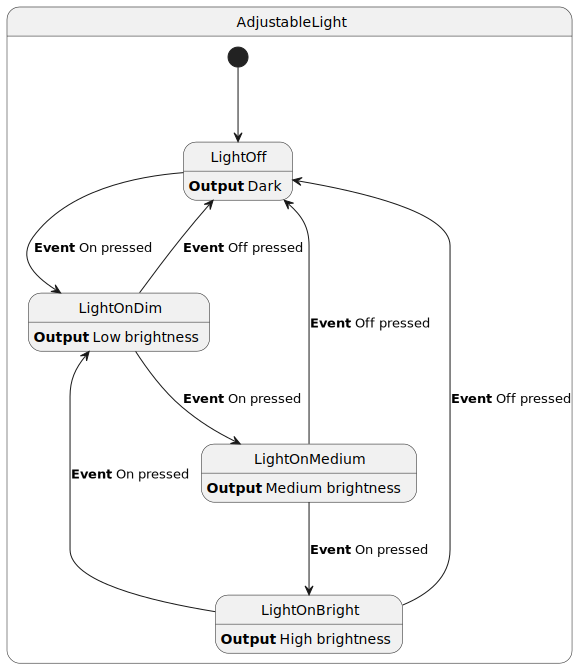

___

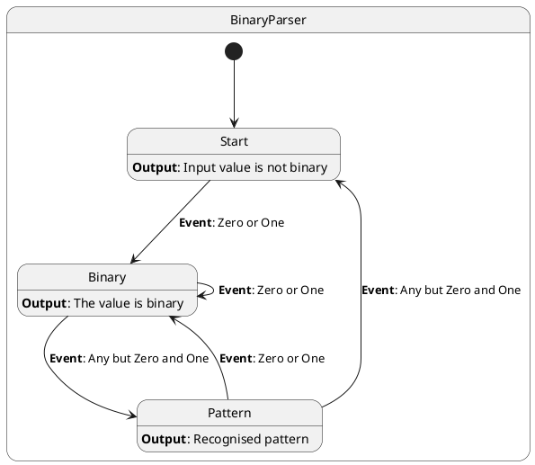


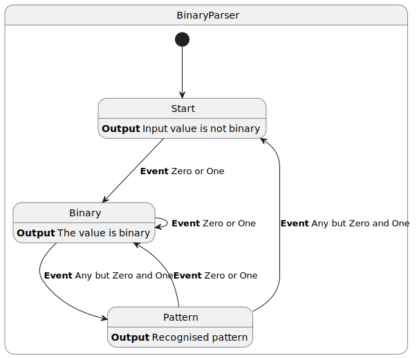

___

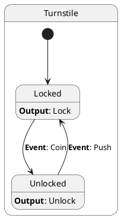

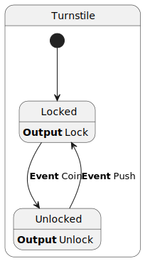

#### Mealy

The following snippet regards the state diagram elements definition in Mealy transformation.

```
state [aMealyMachine.machineName()/] {

	['[' + '*' + ']'/] ---> [aMealyMachine.getInitialState().stateName() /]

	[for (transition : Transition | aMealyMachine.transition) separator('\n')]
	[transition.sourceState.stateName() /] ---> [transition.targetState.stateName()/] : **Event**: [transition.event.name/]\n**Output**: [transition.output.name/]		
	[/for]

}
```

**1.** There is a **for** loop that iterates over every transition and adds a new line after processing it. This processing will consist in:
	- Writing the source state name first
	- Writing a '--->' arrow
	- Writing the target state name third
	- Writing a ':' followed by the expression '**Event**: ' which defines the event that fired the transition
	- Since this is a Mealy machine, a new line is placed using '\n' and the expression '**Output**: ' is folloed by the output name to establish the transition's output
	
The previous transformation was used to generate UML source for 3 previously instantiated, in assignment 3, models of Mealy machines: **1. And Logic Gate**, **2. Or Logic Gate** and **3. Simple Light**.

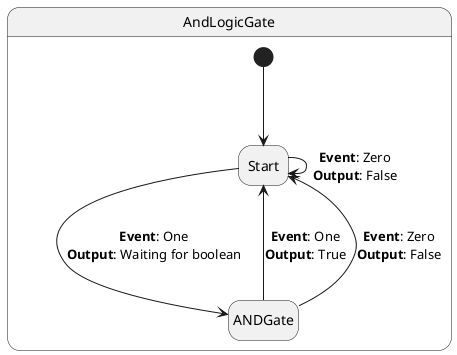

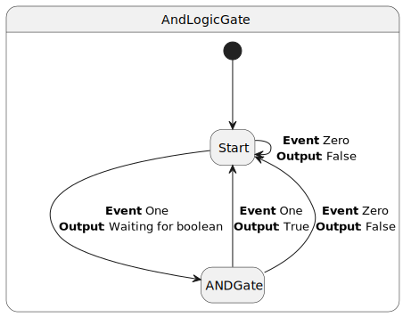

___

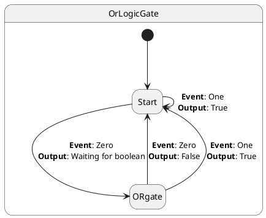

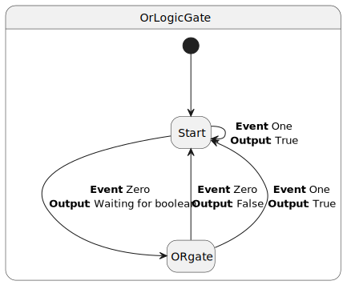

___

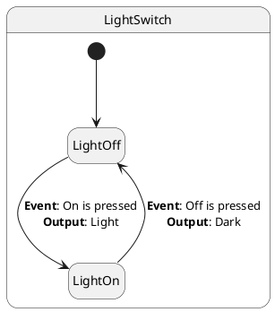

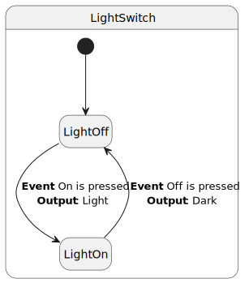

### Java Code

#### Moore

The MTL template generates Java code for a **Moore state machine**. The `Launcher` class initializes all states as `MooreState` objects, each with a **name** and an **output**. It then:

- Creates a set of states
- Defines transitions between them
- Builds a `FiniteStateMachine`
- Allows to change state using events input via console

Each event is generated as a separate Java class extending `AbstractEvent`.

**Key points:**

- States carry output (`getOutput()`)
- Transitions are statically registered
- Interactive event loop with `Scanner`
- Events generated in separate files for modularity


| Special MTL Keys                                                                	  					| Purpose 												|
|-------------------------------------------------------------------------------------------------------|-------------------------------------------------------|
| `[comment encoding = UTF-8 /]`                                                       			| Insert comments or metadata without affecting code 	|
| `[module generateCode('URL')]`                                       							| Declare the MTL module and its metamodel 				|
| `[template public generateCode(aMooreMachine : MooreMachine)]` 							| Main template for generating code from a MooreMachine |
| `[comment @main/]`                                                     							| Marks entry point of generation 						|
| `[file (aMooreMachine.fileName(), false, 'UTF-8')] ...[/file]` 							| Generate a Java files			 						|
| `[for (state : State | aMooreMachine.state)] ... [/for]`         							| Loop through states to generate code 					|
| `[for (transition : Transition | aMooreMachine.transition)]...[/for]` 					| Loop through transitions to generate code 			|
| `[for (e : Event | aMooreMachine.event)]...[/for]`              								| Loop through events to generate separate Java files 	|
| `[query protected ... /]`                                                       					| Queries for cleaner and more maintainable 			|
| `[state.stateName()/]` 																			| Insert the state name in code 						|


```java
[comment encoding = UTF-8 /]
[module generateCode('http://www.example.org/dslmooremachine')]

[template public generateCode(aMooreMachine : MooreMachine)]
[comment @main/]
[file (aMooreMachine.fileName(), false, 'UTF-8')]
package org.jeasy.states.samples.model;

import org.jeasy.states.api.*;
import org.jeasy.states.core.*;
import org.jeasy.states.samples.MooreState;
import org.jeasy.states.samples.turnstile.*;
import java.util.HashSet;
import java.util.Scanner;
import java.util.Set;

public class Launcher {
    public static void main(String['[]'/] args) throws FiniteStateMachineException {
        [for (state : State | aMooreMachine.state)]
        State [state.stateName()/] = new MooreState("[state.name/]", "[state.output.name/]");
        [/for]
        
        Set<State> states = new HashSet<>();
        [for (state : State | aMooreMachine.state)]
        states.add([state.stateName()/]);
        [/for]
        
        [for (transition : Transition | aMooreMachine.transition)]
        Transition [transition.transName()/] = new TransitionBuilder()
            .name("[transition.transName()/]")
            .sourceState([transition.sourceState.stateName()/])
            .eventType([transition.event.eventClassName()/].class)
            .targetState([transition.targetState.stateName()/])
            .build();
        [/for]
        
        FiniteStateMachine fsm = new FiniteStateMachineBuilder(states, [aMooreMachine.initialnode.initialState.stateName()/])
        [for (t : Transition | aMooreMachine.transition)]
        .registerTransition([t.transName()/])
        [/for]
        .build();
        
        System.out.println("Initial State : " + fsm.getCurrentState().getName());
        
        Scanner scanner = new Scanner(System.in);
        System.out.println("Which event do you want to fire?");
        [for (e : Event | aMooreMachine.event)]
        System.out.println("[e.name/]");
        [/for]
        System.out.println("Press 'q' to quit.");
        
        while (true) {
            String input = scanner.nextLine();
            [for (e : Event | aMooreMachine.event)]
            if (input.trim().equalsIgnoreCase("[e.name/]")) {
                fsm.fire(new [e.eventClassName()/]());
                System.out.println("State : " + fsm.getCurrentState().getName());
                System.out.println("Output : " + fsm.getCurrentState().getOutput());
            }
            [/for]
            if (input.trim().equalsIgnoreCase("q")) {
                System.out.println("Bye!");
                System.exit(0);
            }
        }
    }
}

	
	[for (e : Event | aMooreMachine.event)]
	[file (e.eventClassName() + '.java', false, 'UTF-8')]
	package org.jeasy.states.samples.model;
	
	import org.jeasy.states.api.AbstractEvent;
	
	public class [e.eventClassName()/] extends AbstractEvent {
	    public [e.eventClassName()/]() {
	        super("[e.name/]");
	    }
	}
	[/file]
	[/for]

[/file]
[/template]

[query protected stateName(s : State) : String = s.name.replaceAll(' ', '').replaceAll('-', '') /]
[query protected transName(t : Transition) : String = t.sourceState.stateName() + '_' + t.targetState.stateName() /]
[query protected handlerName(t : Transition) : String = t.sourceState.stateName() + '_' + t.targetState.stateName() + '_' + t.event.eventClassName() /]
[query protected eventClassName(e : Event) : String = e.name.replaceAll(' ', '').replaceAll('-', '') /]
[query protected fileName(m : MooreMachine) : String = m.name.replaceAll(' ', '').replaceAll('-', '') + '.java' /]

```


#### Mealy

The MTL template generates Java code for a **Mealy state machine**. Unlike Moore machines, Mealy states **do not have inherent outputs**; outputs are triggered by transitions.  

The `Launcher` class:

- Creates a set of states as `MealyState` objects
- Defines transitions between them
- Builds a `FiniteStateMachine`
- Allows to change state using events input via console

Special aspects:

- Each transition has a custom `EventHandler` class that prints event info
- Events are generated in separate files


| Special MTL Keys																					| Purpose 																		|
|---------------------------------------------------------------------------------------------------|-------------------------------------------------------------------------------|
| `[comment encoding = UTF-8 /]` 																| Metadata or human-readable comments 											|
| `[module generateCode('URL')]`																| Declares module and metamodel for Mealy machines 								|
| `[template public generateCode(aMealyMachine : MealyMachine)]` 						| Main template for generating code from a MealyMachine 						|
| `[comment @main/]` 																			| Marks entry-point template 													|
| `[file (aMealyMachine.fileName(), false, 'UTF-8')] ... [/file]` 						| Generate main Java file for FSM launcher 										|
| `[for (state : State | aMealyMachine.state)] ... [/for]` 								| Loop to declare MealyState objects 											|
| `[for (transition : Transition | aMealyMachine.transition)] ... [/for]` 				| Generate Java code for each transition and its handler 						|
| `[for (e : Event | aMealyMachine.event)] ... [/for]` 									| Generate Java code for each event class in separate files 					|
| `[query protected ... /]` 																	| Queries for cleaner and more maintainable 									|						


```java
[comment encoding = UTF-8 /]
[module generateCode('http://www.example.org/dslmealymachine')]

[template public generateCode(aMealyMachine : MealyMachine)]
[comment @main/]
[file (aMealyMachine.fileName(), false, 'UTF-8')]
package org.jeasy.states.samples.model;

import org.jeasy.states.samples.MealyState;
import org.jeasy.states.api.*;
import org.jeasy.states.core.*;
import org.jeasy.states.samples.lightswitch.*;
import java.util.HashSet;
import java.util.Date;
import java.util.Scanner;

public class Launcher {
    public static void main(String['[]'/] args) throws FiniteStateMachineException {
        [for (state : State | aMealyMachine.state)]
        State [state.stateName()/] = new MealyState("[state.name/]");
        [/for]
        
        Set<State> states = new HashSet<>();
        [for (state : State | aMealyMachine.state)]
        states.add([state.stateName()/]);
        [/for]
        
        [for (transition : Transition | aMealyMachine.transition)]
        Transition [transition.transName()/] = new TransitionBuilder()
            .name("[transition.transName()/]")
            .sourceState([transition.sourceState.stateName()/])
            .eventType([transition.event.eventClassName()/].class)
            .eventHandler(new [transition.handlerName()/]())
            .targetState([transition.targetState.stateName()/])
            .build();
        [/for]
        
        FiniteStateMachine fsm = new FiniteStateMachineBuilder(states, [aMealyMachine.initialnode.initialState.stateName()/])
        [for (t : Transition | aMealyMachine.transition)]
        .registerTransition([t.transName()/])
        [/for]
        .build();
        
        System.out.println("Initial State : " + fsm.getCurrentState().getName());
        
        Scanner scanner = new Scanner(System.in);
        System.out.println("Which event do you want to fire?");
        [for (e : Event | aMealyMachine.event)]
        System.out.println("[e.name/]");
        [/for]
        System.out.println("Press 'q' to quit.");
        
        while (true) {
            String input = scanner.nextLine();
            [for (e : Event | aMealyMachine.event)]
            if (input.trim().equalsIgnoreCase("[e.name/]")) {
                fsm.fire(new [e.eventClassName()/]());
                System.out.println("State : " + fsm.getCurrentState().getName());
            }
            [/for]
            if (input.trim().equalsIgnoreCase("q")) {
                System.out.println("Bye!");
                System.exit(0);
            }
        }
    }
}


	[for (t : Transition | aMealyMachine.transition)]
	[file (t.handlerName() + '.java', false, 'UTF-8')]
	package org.jeasy.states.samples.model;
	
	import org.jeasy.states.api.*;
	import java.util.Date;
	
	public class [t.handlerName()/] implements EventHandler<[t.event.eventClassName()/]> {
	    public void handleEvent([t.event.eventClassName()/] e) {
	        System.out.println("Event '" + e.getName() + "' triggered at " + new Date(e.getTimestamp()));
	        System.out.println("[t.event.name/]");
	    }
	}
	[/file]
	[/for]
	
	[for (e : Event | aMealyMachine.event)]
	[file (e.eventClassName() + '.java', false, 'UTF-8')]
	package org.jeasy.states.samples.model;
	
	import org.jeasy.states.api.AbstractEvent;
	
	public class [e.eventClassName()/] extends AbstractEvent {
	    public [e.eventClassName()/]() {
	        super("[e.name/]");
	    }
	}
	[/file]
	[/for]

[/file]
[/template]

[query protected stateName(s : State) : String = s.name.replaceAll(' ', '').replaceAll('-', '') /]
[query protected transName(t : Transition) : String = t.sourceState.stateName() + '_' + t.targetState.stateName() /]
[query protected handlerName(t : Transition) : String = t.sourceState.stateName() + '_' + t.targetState.stateName() + '_' + t.event.eventClassName() /]
[query protected eventClassName(e : Event) : String = e.name.replaceAll(' ', '').replaceAll('-', '') /]
[query protected fileName(m : MealyMachine) : String = m.name.replaceAll(' ', '').replaceAll('-', '') + '.java' /]

```


## Solution Alternative(s)

### UML Generation

- **Adding annotations** - UML support descriptions using notes that could provide further explanation of transitions and states in the diagram, enhancing visual information

- **Simpler diagram generation option** - the possibility for generating these diagrams without explicit output or event descriptions, resulting in simpler diagrams and removing visual clutter


### Java Code Generation

- **DSL-Based Code Generation with Xtend** - Instead of using Acceleo MTL, it's possible to define a DSL for FSMs and generate Java code using Xtend templates. Still keeps automation but allows the customization of code generated. It's also very compatible with java.

- **Using External FSM Libraries** - Another alternative is to use existing Java FSM libraries like squirrel-foundation FSM. Provides a lightweight, highly flexible and extensible, and type safe Java state machine implementation but it's for enterprise usage and require to learn a new API.


## Alternative Implementation(s)

### UML Generation

- **Other GPLs generation** - Besides generating UML source, generating for other GPLs such as **BPMN** could allow for expressing the state machines in different manners, more representative of the business' context 

### Java Code

- **Multiple code generation templates** - Instead of using a single MTL template, we could create multiple specific templates to be created for Moore and Mealy machines. This allows more modular and maintainable code generation.


## Final Observations and Critical Reflection
This implementation met the objectives of generating java code and UML diagrams for both Mealy and Moore state machines. By using the Easy-States Java library and a metamodel, this assigment demonstrated the benefits of integrating model-driven development techniques into real-world tasks. 

We gained a deeper understanding of the transformation from high-level models to executable code, and the respective role of tools such as Eclipse Modeling Tools, Acceleo, and OCL to facilitate this process. Experimenting with different models highlighted the challenges of maintaining consistency, efficiency, and correctness in automated code generation, and also reinforced the importance of reusing existing frameworks and libraries to accelerate development while ensuring reliability.

Our technical skills were strengthened and our critical reflection was developed, fostering an approach that balances automation, model fidelity, and practical usability. The lessons learned here will be useful for future projects, promoting the adoption of best practices, continuous improvement, and innovative solutions in software engineering.

## Member Contributions Description 

### Student 1: 1221063 - Pedro Pires

- Moore machine code generation
- Moore machine UML generation
- Tested both Moore transformations

### Student 2: 1221818 - Ângelo Oliveira

- Mealy machine code generation
- Mealy machine UML generation
- Tested both Mealy transformations
