# RAMDE: Assignment 5 - Report

## Introduction

This assignment was done in the scope of the RAMDE course, which is part of the Engenharia de Sistemas Computacionais Críticos, or MESC, master's degree lectured at Instituto Superior de Engenharia do Porto (ISEP).

The RAMDE course consists on teaching model-oriented engineering applied to critical systems, focusing on the software development process which involves requirement analysis, using validation/verification tools based on models and application testing.

This repository holds the work of 2 students:

| Student         | Number  | Email               | Github                     |
|-----------------|---------|---------------------|----------------------------|
| Pedro Pires     | 1221063 | 1221063@isep.ipp.pt | https://github.com/Pireza  |
| Ângelo Oliveira | 1221818 | 1221818@isep.ipp.pt | https://github.com/1221818 |


## Glossary

| Acronym | Definition |
|---------------|------------|
| ESS | Enhanced Security System |
| CMS | Central Monitoring Station |
| OOSEM | Object-Oriented Systems Engineering Method |
| SysML | Systems Modeling Language |
| MOE | Measure of Effectiveness |
| MOP | Measure of Performance |
| MTBF | Mean Time Between Failures |
| MTTR | Mean Time To Repair |
| Node | A logical or physical partition in a distributed system |
| Logical Component | A technology-independent abstraction of system functionality |
| Physical Architecture | The real-world implementation of logical system components |
| Parametric Diagram | A diagram showing mathematical relationships between system properties |
| Black-Box Requirement | A requirement based on inputs and outputs without internal detail |
| Traceability | Ability to track requirements across all design levels |


## Problem

This assignment focuses on the development of a residential security system using SysML. Security Systems, Inc., is experiencing a significant decline in sales and customer contract cancellations due to the obsolete security system they use, the current system is not competitive enough and it's losing in the business market. In order to regain market share, the company is investing in developing a new enhanced security system (ESS) that will be more robust, flexible, and will attend to the client and other stakeholder needs.


## Requirements for the Assignment
- **Model the Problem**
  - Requirements
  - Black and White box perspectives
  - Measure of Effectiveness
  - Requirements Traceability

- **Model the Solution**
  - (Sub-)System requirements resulting from the modelled problem
  - High level architecture(s)
  - Some behaviour using at least one state machine
  - Measure of Effectiveness
  - Requirements Traceability

- **Analyse Safety and Reliability**
  - Identify potential hazards and mitigation actions
  - Reflect analysis output while modelling the problem and the solution

- **Java Code Generation**
  - Write Java code representing the state machine transitions using GLS as source

- **Tests Generation**
  - Write automatic tests for your code

- **Support Artifacts**
  - Glossary


## Model the Problem
### Black-box
#### User Needs Requirements Table
From a Black Box perspective, analyzing the system externally, the following stakeholder needs were identified.

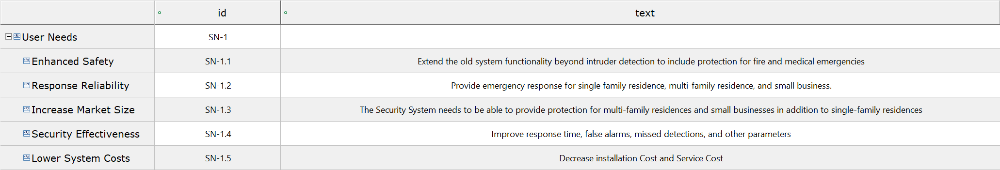

#### System Context
After identifying the stakeholder needs, it is important to understand the environment in which the System of Interest (SOI) will operate. The diagram shows the system’s context while entities from the old system are retained, new participants are introduced, and entities like firefighters or the police are part of the emergency services. Now there are new property types—commercial and multi-family—are included in the system.


#### Use Cases
Three main use cases were identified:
- **Emergency Response**: **Occupant** actor addresses general Emergency use cases, the **Intruder** actor addresses more specific invasion use cases, and the **Physical Environment** represents other kind of hazards such as fires.
- **Mitigation Failure**
- **Investigative Data**

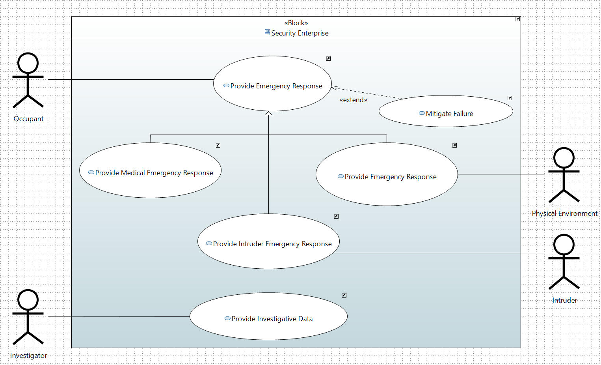

#### Activity Diagram
This following Activity Diagram was made for the use case **Provide Intruder Emergency Response**, where it's possible to visualize that the **Occupant** actor triggered system activation, then the system will monitorize and notify the responsible authorities in order to capture the intruder.

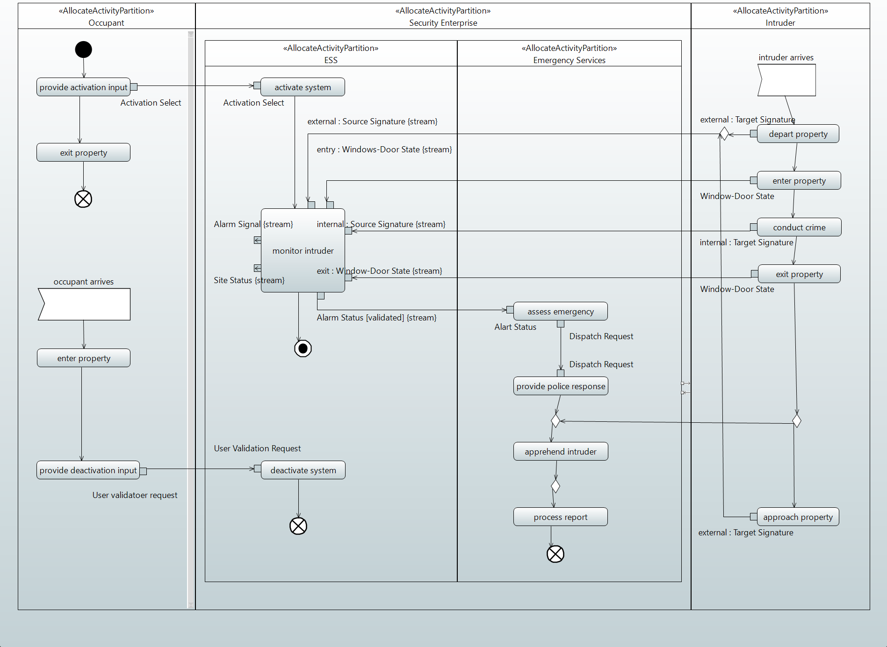

#### Measure of Effectiveness (MoE)
In MoE is possible to identify metrics, such as **Availability** for the time the system is activated, **Emergency Response Time** for the time in minutes, **Probability Of Intruder Conviction** for percentage of Intruder capture, and **Operational Cost** for the cost and respective coin exchange.

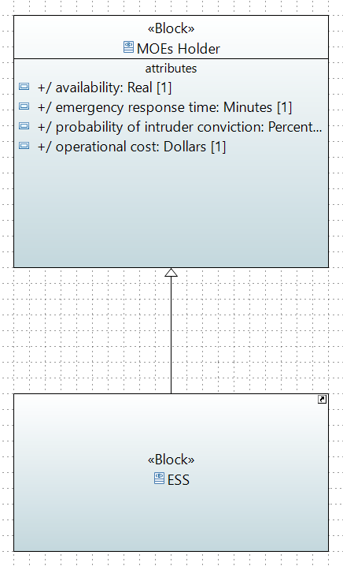


### White-box
#### Functional Analysis with System Behavior
In the previous Black Box diagram, the "Monitor Intruder" appeared as a single unit, showing only its incoming and outgoing flows. With this next diagram, we can provide a more detailed view of the system’s internal workings and what used to be simple inputs and outputs are now mapped to specific internal processes.

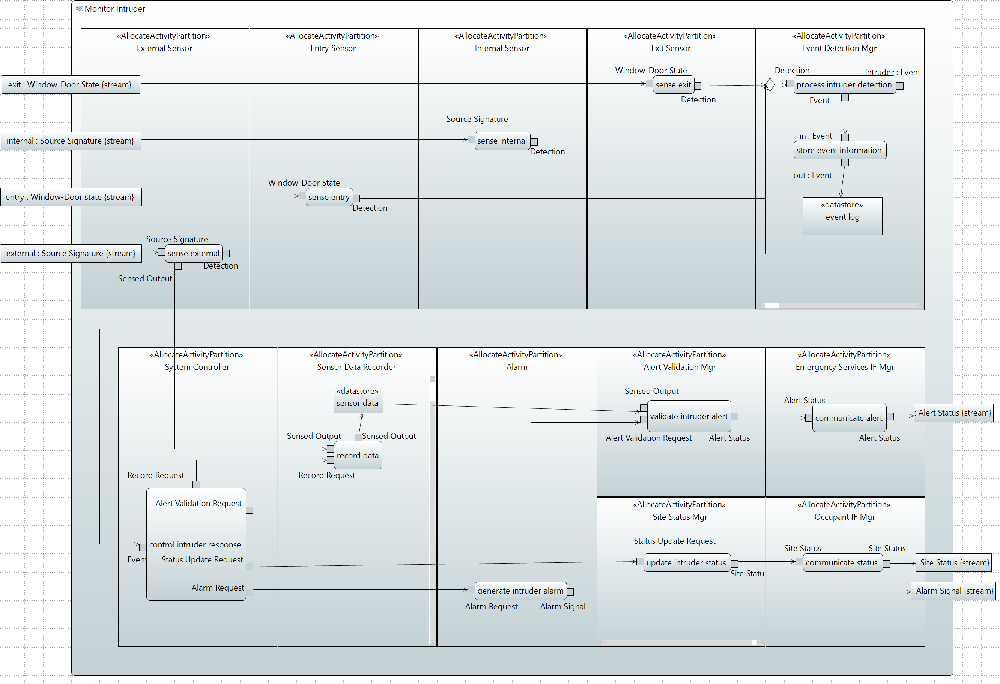

#### Interfaces
#### Logical Architecture
Based on the "System Context," some of the system’s interfaces and exchanged items were also identified, and it's important to note that only the interfaces interacting with the external environment are visible at this point.

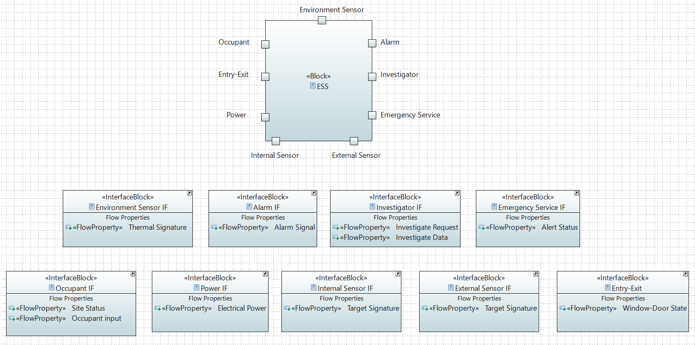

#### Logical Subsystems
The Logical Subsystem divides the system into components for external interaction and business logic. Sensors handle external inputs, while the Event Detection Manager and System Controller process detections and coordinate responses. Other components manage alarms, status, validation, and investigative data, with connectors enabling communication between them.


#### Traceability
The internal activities of the **Monitor Intruder** process were mapped, and the **MoEs** identified in the Black Box phase were linked to the stakeholder needs identified as follow.

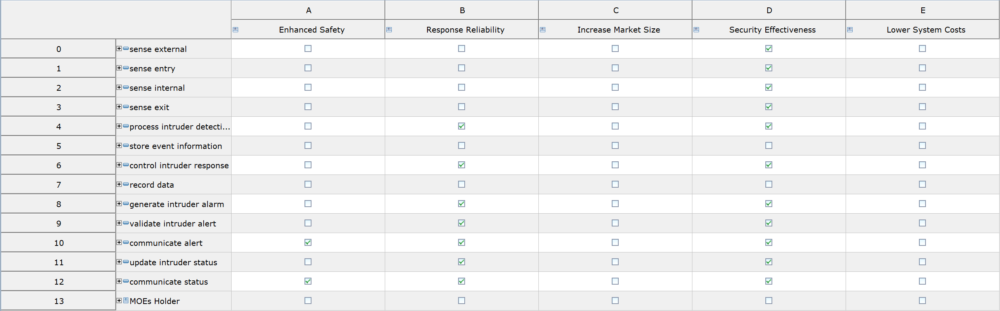


## Model the Solution

After modelling the problem, the solution is up next.

First and foremost, it is necessary to identify the **system requirements** derived from the Stakeholder needs defined in the previous section.

### Requirements

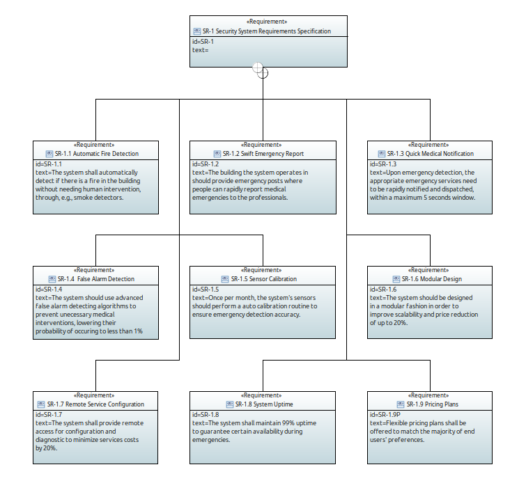

To highlight how these coorrelate to the stakeholder needs, the image below defines their association with the system requirements, i.e., the **System Requirements Traceability**.

### Requirements Traceability

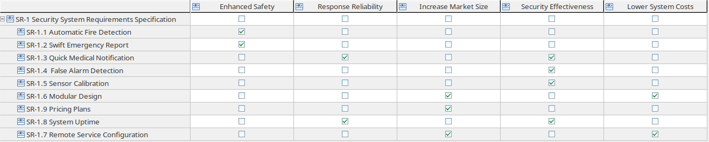

___

### High Level System Architecture

After establishing the system's requirements, the next big step is to define the **High Level System Architecture** which highlights the system's main structure and its subsystems, as well as how they communicate between each other so they may correctly perform their functions.

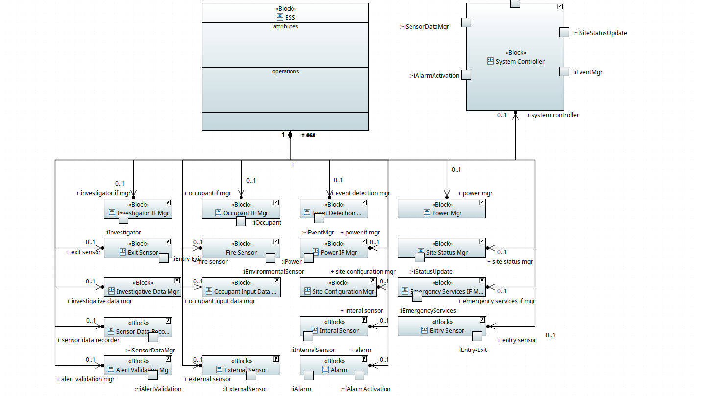

After analysing the **System Requirements**, there are many ways to structure the **ESS**. The approach that was taken, as seen in the image above, resulted in **19 different modules**, i.e., **Subsystems**. The main reason for decomposing the main system in so many subsystems is obviously due to the **SR-1.6 Modular Design** and **SR-1.9 Pricing Plans** system requirements.

All these different subsystems interact with the environment through specific **Interfaces**, which can be seen in the image below. 

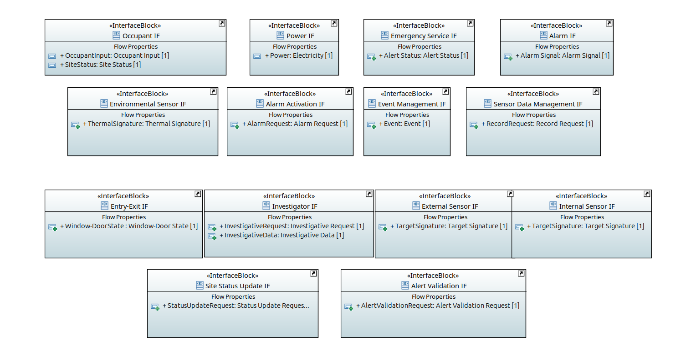

Also, the communication is done through the exchange of specific items between them. These **Exchange Items** are evidenced below as well.

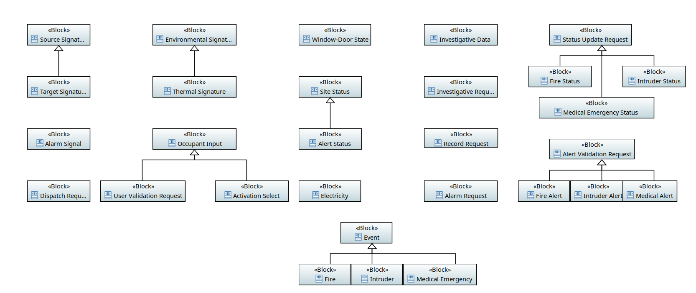

This architecture defines 3 different types of subsystems:

- Subsystems that interact directly with the external environment, such as **External Sensor**;
- Subsystem that process data, such as the **System Controller**, which will be further detailed in later sections;
- Subsystems that facilitate their interaction with its users, such as **Occupant IF Mgr**.

___

### Control Subsystem

In this section, the **System Controller** subsystem will be finely explored and modelled, architecture and behaviour wise.

This subsystem is the **"conductor"** that orchestrates the whole system, ensuring their sinchronised activity and best results possible.

#### Control Subsystem Requirements

As it was done with the **ESS System** itself, the first step in modelling the subsystem is to define its requirements, and their **Traceability**.

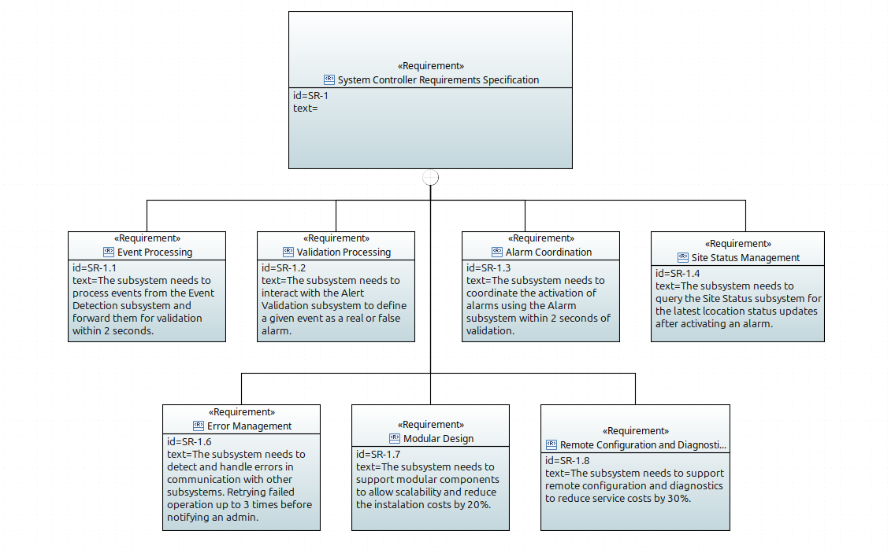

#### Control Subsystem Requirements Traceability

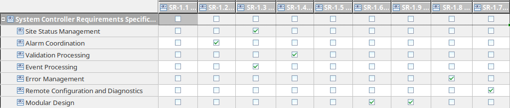

___

#### Control Subsystem High Level Architecture

After setting the requirements, the subsystems components can be designed around the defined functionalities. The image below highlights those smaller components.

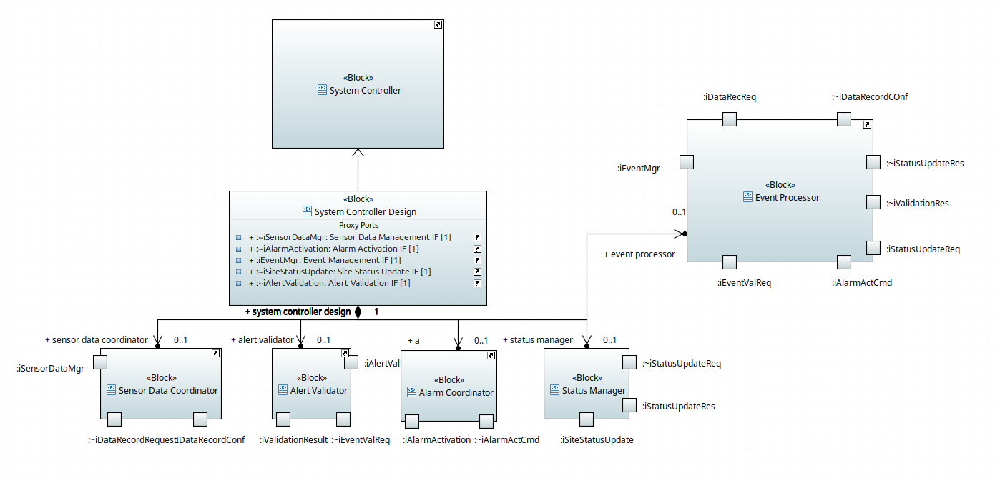


This structure aludes to the **ESS High Level System Architecture**, given how the same interfaces that were present in the previous diagram reappear here.

The subsystem components functions are as follows:

- **Sensor Data Coordinator -** Requests registry data to the **Sensor Data Recorder**  component through the **Sensor Data Mgr** interface;

- **Event Processor -** Receives events from the **Event Detection** component through the **Event Mgr** interface;

- **Alarm Coordinator -** Requests for alarm activation to **Alarm** component through the **Alarm Activation** interface;

- **Alert Validator -** Requests alert validation to **Alert Validation** component through the **Alert Validation** interface;

- **Status Manager -** Requests state update to the **Site Status** component through the **Site Status Update** interface.

Once again, these components describe their behaviour by communicating with each other, as well as interacting with the external environment. For that, they make use of specific interfaces, defined below.

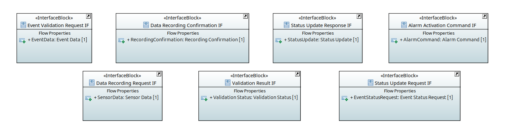

It is through these **Interfaces** that each subsystem sends and receives **Exchange Items**, highlighted below.

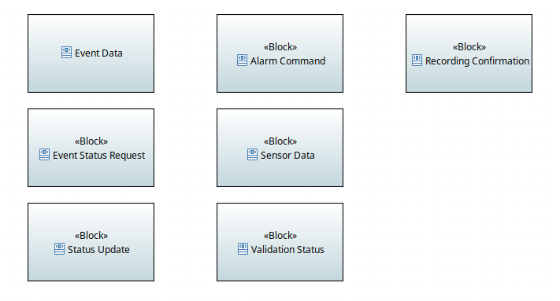

___

#### Exchange Items Flow

The following diagram depicts, with detail, the flow of information in the **Controller Subsystem**.

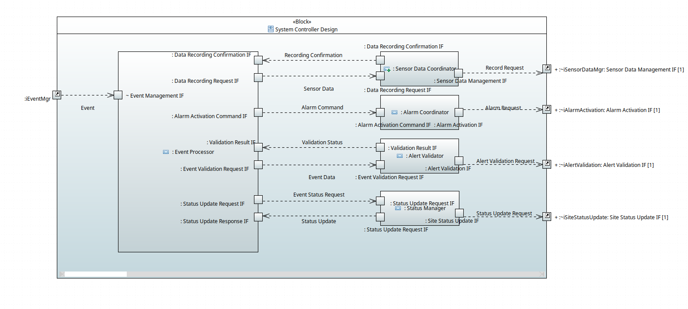


- Upon an **Event**, the **Alert Validator** component determines if it is valid, in which case the **Event Processor** component performs its corresponding action.

- The **Event Processor** component prompts **Alarm Coordinator** to execute an **Alarm Request**.

- At the same time, the **Status Manager** component updates the building state, requesting for emergency services.

- All event related informations are stored by the **Sensor Data Coordinator**.

#### Subsystem Behaviour


The behaviour that was chosen refers to the flow of exchange items described before, accounting for sequentiallity of events.
___

#### Measures of Effectivness

This subsystem inherits the MOEs defined in the problem modelling phase. However, it redefines on of those MOEs to assign it specific constraints. Given how the **Control Subsystem** orchestrates the **ESS**, it is mandatory to ensure the **Total Emergency Response Time** matches the specifications under the **System Requirements** of less than 5 seconds.

The following diagram defines all of the time slices that compute the total response time.

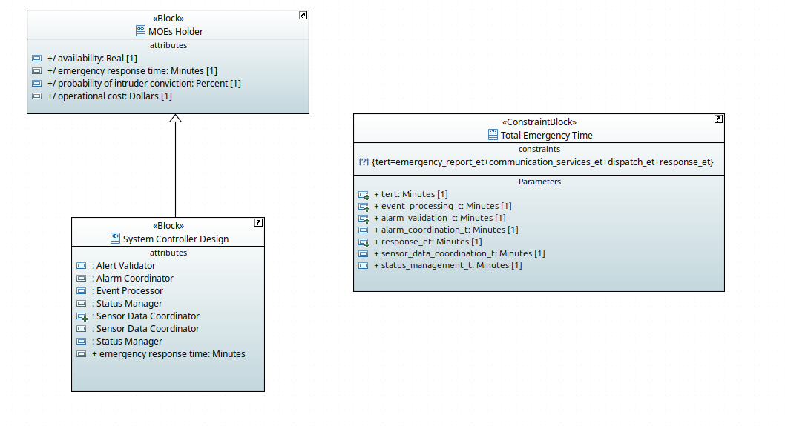

The image below further details which components are responsible for incrementing the total response time.

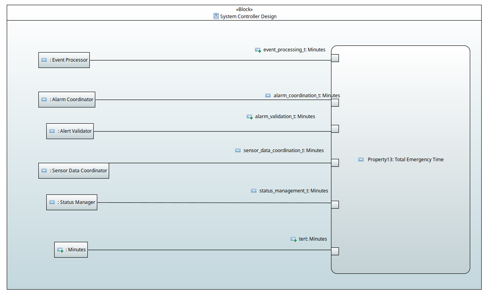

Finally, it is in the diagram below, that the constraint itself is specified:

```java
tert <= 5 / 60
```

**Note:** The constraint is defined as **5/60** given how time is measured in minutes.

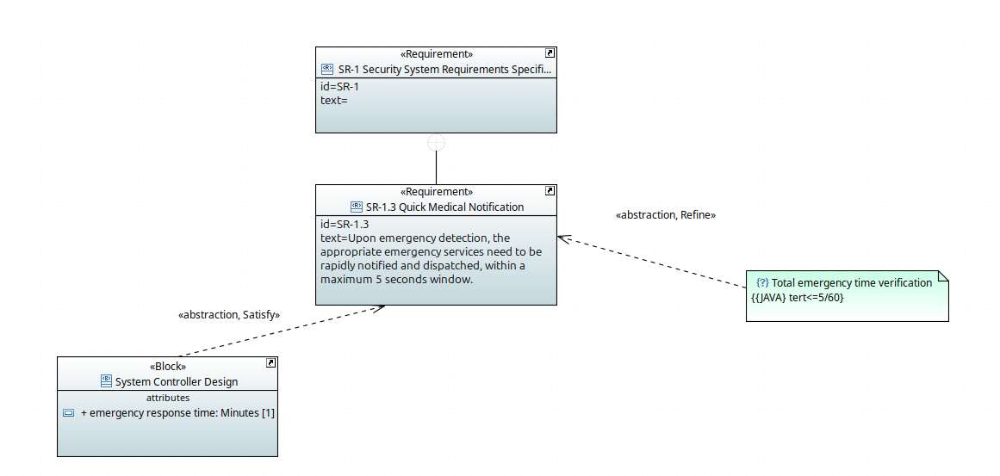


## Analyze Safety and Reliability
Safety and reliability analysis of the Enhanced Security System (ESS) is essential to ensure effective emergency response. By modelling hazards, failure modes, and mitigation strategies, the system design becomes more secure while maintaining the stakeholder needs and requirements.

### Safety and Reliability Overview
Throughout the modelling safety and reliability were treated as core system qualities, mission scenarios and system requirements helped identify threats that could compromise detection and response capabilities, shaping the architecture toward fault-tolerant solution.

### Sensor Hazards and Mitigations
Failures in sensors, such as missing, noisy, or incorrect data were identified as major hazards. These were modelled as failure modes linked to ESS functions. Mitigation includes redundant sensing, scheduled calibration, and behaviour-based validation mechanisms that reduce false alarms and undetected events.

### Communication Failures and Interface Reliability
The system context model revealed risks related to communication between the ESS, the monitoring station, and emergency services, the item flows and port specifications allowed communication failures to be analysed. Mitigating actions include better protocols, timeout handling, and alternative communication paths to ensure emergency alerts remain reliable.

### Power Risks and Continuity Measures
Power loss can disable the entire system, and modelling the physical architecture exposed dependencies on power sources, motivating the creation of backup power modules and power monitoring. 
These ensure operational availability even during system failures.

### Algorithmic and Processing Errors
Errors in detection algorithms can create false positives or false negatives, they were captured through constraints and state-machine analysis. Being mitigated by strategies that involve multi-sensor fusion, threshold validation, and fault detection with recovery behaviours.

### Integration of Hazard Analysis into System Design
Hazards were linked to requirements, logical components, and interfaces, maintaining traceability. This integration ensures that the final ESS architecture is not only functional but capable of anticipating, isolating, and recovering from failures, delivering consistent performance across emergency scenarios.


## Code generation for the state machine(s) modelled

Code generation was performed using the same tools as in assignment 4, the **Acceleo** plugin. The objective is to ensure that any **ESS** behaviour that gets represented through a **UML/SysUML State Machine** can be automatically translated into runnable code that respects the represented **States**, **Transitions** and their **Triggers**.

To facilitate the implementation, the **Easy States**, by Mahmoud Ben Hassine, framework was, once again, used to instantiate the **Finite State Machine**.

All **State Machine** code that is generated under the **assignment5/control-system-states/easy-states-master/src/test/java/org/jeasy/states/samples/ess** directory. This was done to ensure that, upon being generated, the code is immediately runnable, with no need to fiddle with package refactoring.

### Generated java and tests code
The generated files are allocated to predefined target directories. Within the directory **samples**, the main java code is in the folder **ess** and generated tests are in the folder **essTests**.

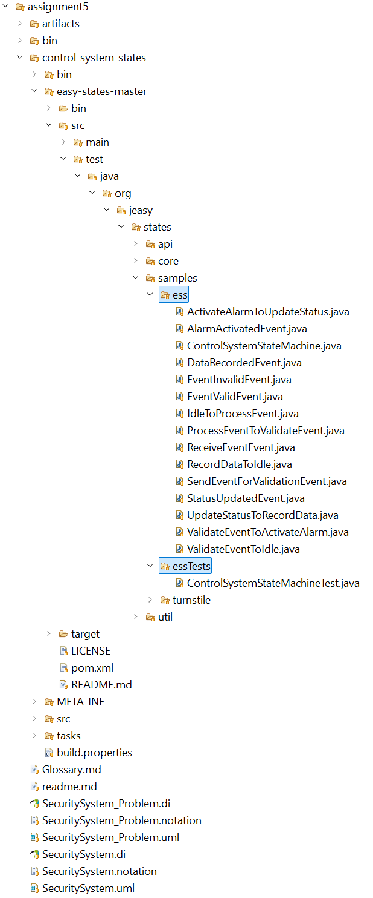

### Generator Template

This subsection highlights the structure of the template used for generating code for **State Machines** representing system behaviours.

In order to ensure modularity, and also to comply with the Java language patterns, all generated classes were defined inside specific approprietly name `.java` files.

However, **due to problems with the Eclipse and Acceleo plugin tools used during the developement of assignment  5**, it was not possible to achieve **modularity at the templates files level**. Nonetheless, it is good practice and would be an improvement of this project overall.

#### Main Class

```ejs
[comment encoding = UTF-8 /]
[module generate('http://www.eclipse.org/papyrus/sysml/1.6/SysML', 'http://www.eclipse.org/uml2/5.0.0/UML', 'http://www.eclipse.org/papyrus/sysml/1.6/SysML/Blocks')]


[template public generateElement(aStateMachine : StateMachine)]
[comment @main/]
[file (aStateMachine.fileName(), false, 'UTF-8')]

package org.jeasy.states.samples.ess;

import org.jeasy.states.api.FiniteStateMachine;
import org.jeasy.states.api.FiniteStateMachineException;
import org.jeasy.states.api.State;
import org.jeasy.states.api.Transition;
import org.jeasy.states.core.TransitionBuilder;
import org.jeasy.states.core.FiniteStateMachineBuilder;

import java.util.Set;
import java.util.HashSet;
import java.util.Scanner;

class Launcher {
    public static void main(String['[]'/] args) throws FiniteStateMachineException {

        [for (state : State | aStateMachine.getAllStates())]
        State [state.getStateName().varName().camelCaseName()/] = new State("[state.name/]");
        [/for]
        
        Set<State> states = new HashSet<>();
        [for (state : State | aStateMachine.getAllStates())]
        states.add([state.getStateName().varName().camelCaseName()/]);
        [/for]
        
        [for (transition : Transition | aStateMachine.getAllTransitions())]
        Transition [transition.getTransitionName().varName().camelCaseName()/] = new TransitionBuilder()
            .name("[transition.getTransitionName()/]")
            .sourceState([transition.source.oclAsType(State).getStateName().varName().camelCaseName()/])
            .eventType([transition.trigger.getEventName().varName()/].class)
            .eventHandler(new [transition.getHandlerName().varName()/]())
            .targetState([transition.target.oclAsType(State).getStateName().varName().camelCaseName()/])
            .build();

        [/for]
        FiniteStateMachine fsm = new FiniteStateMachineBuilder(states, [aStateMachine.getInitialState().getStateName().varName().camelCaseName()/])
        [for (t : Transition | aStateMachine.getAllTransitions())]
        .registerTransition([t.getTransitionName().varName().camelCaseName()/])
        [/for]
        .build();
        
        System.out.println("Initial State : " + fsm.getCurrentState().getName());
        
        Scanner scanner = new Scanner(System.in);
       	System.out.println("Which event do you want to fire? (Enter the number)");

		[for (e : Trigger | aStateMachine.getAllEvents())]
		System.out.println("[i/]. [e.getEventName()/]");
		[/for]

		System.out.println("\nPress 'q' to quit.\n");

		while (true) {
    		System.out.print("Enter your choice: ");
    		String input = scanner.nextLine();

    	[for (e : Trigger | aStateMachine.getAllEvents())]
    		if (input.trim().equals("[i/]")) {
				System.out.println("Firing [e.getEventName()/]...");
       			fsm.fire(new [e.getEventName().varName()/]());
        		System.out.println("Current State : " + fsm.getCurrentState().getName());
    		}
    	[/for]

    		if (input.trim().equals("q")) {
        		System.out.println("Bye!");
        		System.exit(0);
    		}
            System.out.println();
    	}
	}
}
[/file]
```

This template generated this specific **Main** class for the **State Machine** from before:

```java

package org.jeasy.states.samples.ess;

import org.jeasy.states.api.FiniteStateMachine;
import org.jeasy.states.api.FiniteStateMachineException;
import org.jeasy.states.api.State;
import org.jeasy.states.api.Transition;
import org.jeasy.states.core.TransitionBuilder;
import org.jeasy.states.core.FiniteStateMachineBuilder;

import java.util.Set;
import java.util.HashSet;
import java.util.Scanner;

class Launcher {
    public static void main(String[] args) throws FiniteStateMachineException {

        State idle = new State("Idle");
        State updateStatus = new State("Update Status");
        State processEvent = new State("Process Event");
        State validateEvent = new State("Validate Event");
        State activateAlarm = new State("Activate Alarm");
        State recordData = new State("Record Data");
        
        Set<State> states = new HashSet<>();
        states.add(idle);
        states.add(updateStatus);
        states.add(processEvent);
        states.add(validateEvent);
        states.add(activateAlarm);
        states.add(recordData);
        
        Transition updateStatusToRecordData = new TransitionBuilder()
            .name("Update Status To Record Data")
            .sourceState(updateStatus)
            .eventType(StatusUpdatedEvent.class)
            .eventHandler(new UpdateStatusToRecordData())
            .targetState(recordData)
            .build();

        Transition validateEventToIdle = new TransitionBuilder()
            .name("Validate Event To Idle")
            .sourceState(validateEvent)
            .eventType(EventInvalidEvent.class)
            .eventHandler(new ValidateEventToIdle())
            .targetState(idle)
            .build();

        Transition processEventToValidateEvent = new TransitionBuilder()
            .name("Process Event To Validate Event")
            .sourceState(processEvent)
            .eventType(SendEventForValidationEvent.class)
            .eventHandler(new ProcessEventToValidateEvent())
            .targetState(validateEvent)
            .build();

        Transition activateAlarmToUpdateStatus = new TransitionBuilder()
            .name("Activate Alarm To Update Status")
            .sourceState(activateAlarm)
            .eventType(AlarmActivatedEvent.class)
            .eventHandler(new ActivateAlarmToUpdateStatus())
            .targetState(updateStatus)
            .build();

        Transition idleToProcessEvent = new TransitionBuilder()
            .name("Idle To Process Event")
            .sourceState(idle)
            .eventType(ReceiveEventEvent.class)
            .eventHandler(new IdleToProcessEvent())
            .targetState(processEvent)
            .build();

        Transition recordDataToIdle = new TransitionBuilder()
            .name("Record Data To Idle")
            .sourceState(recordData)
            .eventType(DataRecordedEvent.class)
            .eventHandler(new RecordDataToIdle())
            .targetState(idle)
            .build();

        Transition validateEventToActivateAlarm = new TransitionBuilder()
            .name("Validate Event To Activate Alarm")
            .sourceState(validateEvent)
            .eventType(EventValidEvent.class)
            .eventHandler(new ValidateEventToActivateAlarm())
            .targetState(activateAlarm)
            .build();

        FiniteStateMachine fsm = new FiniteStateMachineBuilder(states, idle)
        .registerTransition(updateStatusToRecordData)
        .registerTransition(validateEventToIdle)
        .registerTransition(processEventToValidateEvent)
        .registerTransition(activateAlarmToUpdateStatus)
        .registerTransition(idleToProcessEvent)
        .registerTransition(recordDataToIdle)
        .registerTransition(validateEventToActivateAlarm)
        .build();
        
        System.out.println("Initial State : " + fsm.getCurrentState().getName());
        
        Scanner scanner = new Scanner(System.in);
       	System.out.println("Which event do you want to fire? (Enter the number)");

		System.out.println("1. Send Event For Validation Event");
		System.out.println("2. Data Recorded Event");
		System.out.println("3. Alarm Activated Event");
		System.out.println("4. Status Updated Event");
		System.out.println("5. Receive Event Event");
		System.out.println("6. Event Valid Event");
		System.out.println("7. Event Invalid Event");

		System.out.println("\nPress 'q' to quit.\n");

		while (true) {
    		System.out.print("Enter your choice: ");
    		String input = scanner.nextLine();

    		if (input.trim().equals("1")) {
				System.out.println("Firing Send Event For Validation Event...");
       			fsm.fire(new SendEventForValidationEvent());
        		System.out.println("Current State : " + fsm.getCurrentState().getName());
    		}
    		if (input.trim().equals("2")) {
				System.out.println("Firing Data Recorded Event...");
       			fsm.fire(new DataRecordedEvent());
        		System.out.println("Current State : " + fsm.getCurrentState().getName());
    		}
    		if (input.trim().equals("3")) {
				System.out.println("Firing Alarm Activated Event...");
       			fsm.fire(new AlarmActivatedEvent());
        		System.out.println("Current State : " + fsm.getCurrentState().getName());
    		}
    		if (input.trim().equals("4")) {
				System.out.println("Firing Status Updated Event...");
       			fsm.fire(new StatusUpdatedEvent());
        		System.out.println("Current State : " + fsm.getCurrentState().getName());
    		}
    		if (input.trim().equals("5")) {
				System.out.println("Firing Receive Event Event...");
       			fsm.fire(new ReceiveEventEvent());
        		System.out.println("Current State : " + fsm.getCurrentState().getName());
    		}
    		if (input.trim().equals("6")) {
				System.out.println("Firing Event Valid Event...");
       			fsm.fire(new EventValidEvent());
        		System.out.println("Current State : " + fsm.getCurrentState().getName());
    		}
    		if (input.trim().equals("7")) {
				System.out.println("Firing Event Invalid Event...");
       			fsm.fire(new EventInvalidEvent());
        		System.out.println("Current State : " + fsm.getCurrentState().getName());
    		}

    		if (input.trim().equals("q")) {
        		System.out.println("Bye!");
        		System.exit(0);
    		}
            System.out.println();
    	}
	}
}
```
___

####

```ejs
[comment Event classes creation/]

[for (event : Trigger | aStateMachine.getAllEvents())]
	[file (event.getEventName().varName() + '.java', false, 'UTF-8')]
    package org.jeasy.states.samples.ess;
	
	import org.jeasy.states.api.AbstractEvent;
	
	public class [event.getEventName().varName()/] extends AbstractEvent {
	    public [event.getEventName().varName()/]() {
	        super("[event.getEventName()/]");
	    }
	}
	[/file]
[/for]
[/template]
```

This template generated this specific **Event** class for the **State Machine** from before:

```java
    package org.jeasy.states.samples.ess;
	
	import org.jeasy.states.api.AbstractEvent;
	
	public class DataRecordedEvent extends AbstractEvent {
	    public DataRecordedEvent() {
	        super("Data Recorded Event");
	    }
	}
```
___

```ejs
[comment Event Handler classes creation/]

[for (t : Transition | aStateMachine.getAllTransitions())]
	[file (t.getHandlerName().varName() + '.java', false, 'UTF-8')]
	package org.jeasy.states.samples.ess;
	
	import org.jeasy.states.api.*;
	import java.util.Date;
	
	public class [t.getHandlerName()/] implements EventHandler<[t.trigger.getEventName().varName()/]> {
	    public void handleEvent([t.trigger.getEventName().varName()/] e) {
	        System.out.println("Event '" + e.getName() + "' triggered at " + new Date(e.getTimestamp()));
	        System.out.println("[t.trigger.getEventName()/]");
	    }
	}
	[/file]
[/for]
```

This template generated this specific **EventHandler** class for the **State Machine** from before:

```java
	package org.jeasy.states.samples.ess;
	
	import org.jeasy.states.api.*;
	import java.util.Date;
	
	public class ActivateAlarmToUpdateStatus implements EventHandler<AlarmActivatedEvent> {
	    public void handleEvent(AlarmActivatedEvent e) {
	        System.out.println("Event '" + e.getName() + "' triggered at " + new Date(e.getTimestamp()));
	        System.out.println("Alarm Activated Event");
	    }
	}
```


#### Queries

One important feature of the language used for the templates are **Queries**, which provide a means of making the template more readable, while performing complex tasks on the **State Machine's** elements.

```ejs
[query protected getAllEvents(sm : StateMachine) : OrderedSet(Trigger) = sm.region.transition.trigger->flatten()->asOrderedSet()/]
[query protected getEventIndex(event : Trigger, sm : StateMachine) : Integer = sm.getAllEvents()->indexOf(event) + 1/]
[query protected getAllTransitions(sm : StateMachine) : Set(Transition) = sm.region.transition->flatten()->select(t | t.source.oclIsKindOf(State))->asSet()/]
[query protected getAllStates(sm : StateMachine) : Set(State) = sm.region.subvertex->flatten()->select(v | v.oclIsKindOf(State))->asSet()/]
[query protected getInitialState(sm : StateMachine) : State = sm.region.subvertex->flatten()->select(v | v.oclIsKindOf(Pseudostate) and v.oclAsType(Pseudostate).kind = PseudostateKind::initial)->any(true).outgoing.target->any(true).oclAsType(State)/]

[query protected getEventName(e : Trigger) :  String = e.name + ' Event'/]
[query protected getTransitionName(t : Transition) :  String = t.source.name + ' To ' + t.target.name/]
[query protected getStateName(s : State) : String = s.name/]
[query protected getHandlerName(t : Transition) :  String = (getTransitionName(t)).varName()/]

[query protected fileName(sm : StateMachine) : String = sm.name.varName() + '.java' /]
[query protected varName(s : String) : String = s.replaceAll(' ', '').replaceAll('-', '')/]
[query protected camelCaseName(name : String) : String = name.substring(1,1).toLower() + name.substring(2, name.size())/]
```

Some queries include:

- Generating variable names, in compliance to the Java programming languages patterns;
- Retrieving all **State Machine** states;
- Generating class names, in compliance to the Java programming languages patterns;
- Retrieving the **Initial State** of the **State Machine**.

#### Demo

The following image depicts a demonstration of the generated implementation of the State Machine code and its response to the firing of Events that trigger a transition, and others that don't.

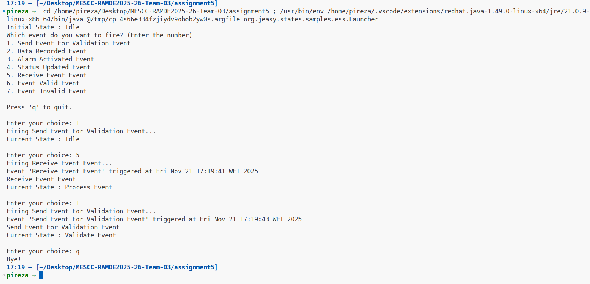

## Automatic tests generation
This file can generate multiple tests of transition between states from our state machine, using the library **Easy States** in Java.

#### Needed imports
Import Java classes from Easy States library and generated classes for event and handlers in transitions.
```java
package org.jeasy.states.samples.essTests;

import org.jeasy.states.api.*;
import org.jeasy.states.core.*;
import org.junit.Test;
import org.junit.Before;

import java.util.Set;
import java.util.HashSet;

[for (t : Transition | aStateMachine.getAllTransitions())]
import org.jeasy.states.samples.ess.[t.trigger.getEventName().varName()/];
import org.jeasy.states.samples.ess.[t.getHandlerName().varName()/];
[/for]
```

#### Declaration of Transitions and States
Define states and transitions as global variables 
```java
public class [aStateMachine.name.varName()/]Test {
    [for (s : State | aStateMachine.getAllStates())]
    private State [s.getStateName().varName().camelCaseName()/];
    [/for]
    private Set<State> states;

    [for (t : Transition | aStateMachine.getAllTransitions())]
    private Transition [t.getTransitionName().varName().camelCaseName()/];
    [/for]
```

#### Setup
Initializes states and transitions for all tests.
```java
    @Before
    public void setUp() {
        // Criação de Estados
        [for (s : State | aStateMachine.getAllStates())]
        [s.getStateName().varName().camelCaseName()/] = new State("[s.name/]");
        [/for]

        states = new HashSet<>();
        [for (s : State | aStateMachine.getAllStates())]
        states.add([s.getStateName().varName().camelCaseName()/]);
        [/for]

        // Criação de Transições
        [for (t : Transition | aStateMachine.getAllTransitions())]
        [t.getTransitionName().varName().camelCaseName()/] = new TransitionBuilder()
            .name("[t.getTransitionName()/]")
            .sourceState([t.source.oclAsType(State).getStateName().varName().camelCaseName()/])
            .eventType([t.trigger.getEventName().varName()/].class)
            .eventHandler(new [t.getHandlerName().varName()/]())
            .targetState([t.target.oclAsType(State).getStateName().varName().camelCaseName()/])
            .build();
        [/for]
    }
```

#### Test for each state transition
Each state transition generates an unit test to check if the transition changes as expected.
```java
    [for (t : Transition | aStateMachine.getAllTransitions())]
    @Test
    public void shouldChangeTransition_[t.getTransitionName().varName()/]() throws FiniteStateMachineException {
        FiniteStateMachine fsm = new FiniteStateMachineBuilder(states, [t.source.oclAsType(State).getStateName().varName().camelCaseName()/])
        [for (tt : Transition | aStateMachine.getAllTransitions())]
            .registerTransition([tt.getTransitionName().varName().camelCaseName()/])
        [/for]
            .build();

        fsm.fire(new [t.trigger.getEventName().varName()/]());

        assertEquals(
            fsm.getCurrentState(),
            [t.target.oclAsType(State).getStateName().varName().camelCaseName()/]
        );
    }
    [/for]

```

#### Test an invalid state transition
Checks if state does not change with wrong transitions.
```java
    @Test
    public void shouldNotChangeState_InvalidTransitions() throws FiniteStateMachineException {
        FiniteStateMachine fsm = new FiniteStateMachineBuilder(states, [aStateMachine.getInitialState().getStateName().varName().camelCaseName()/])
        [for (t : Transition | aStateMachine.getAllTransitions())]
            .registerTransition([t.getTransitionName().varName().camelCaseName()/])
        [/for]
            .build();

        // Pick event of a transition that doesn't start at initial state
        [for (t : Transition | aStateMachine.getAllTransitions())]
        [if (not (t.source = aStateMachine.getInitialState()))]
        fsm.fire(new [t.trigger.getEventName().varName()/]());
        [/if]
        [/for]

        assertEquals(
            fsm.getCurrentState(),
            [aStateMachine.getInitialState().getStateName().varName().camelCaseName()/]
        );
    }
}

```

#### Queries for tests
Important feature of the language used for the templates are Queries, which provide a means of making the template more readable, while performing complex tasks on the State Machine's elements.

```ejs
[query protected getAllStates(sm : StateMachine) : Set(State) = sm.region.subvertex->select(v | v.oclIsKindOf(State))->collect(v | v.oclAsType(State))->asSet()/]
[query protected getAllTransitions(sm : StateMachine) : Set(Transition) = sm.region.transition->flatten()->select(t | t.source.oclIsKindOf(State))->asSet()/]

[query protected getInitialState(sm : StateMachine) : State =
    sm.region.subvertex
    ->select(v | v.oclIsKindOf(Pseudostate) and v.oclAsType(Pseudostate).kind = PseudostateKind::initial)
    ->any(true).outgoing.target->any(true).oclAsType(State)
/]

[query protected getStateName(s : State) : String = s.name /]
[query protected getEventName(e : Trigger) : String = e.name + 'Event' /]
[query protected getTransitionName(t : Transition) :  String = t.source.name + ' To ' + t.target.name/]
[query protected getHandlerName(t : Transition) : String = (getTransitionName(t)).varName() /]
[query protected fileName(sm : StateMachine) : String = sm.name.varName() + 'Test.java' /]

[query protected varName(s : String) : String =
  s
    .replaceAll('[^a-zA-Z0-9_]', '')
    .replaceAll('^[0-9]+', '')
/]

[query protected camelCaseName(name : String) : String = name.substring(1,1).toLower() + name.substring(2)/]
```

#### Java Tests generated
```java

package org.jeasy.states.samples.essTests;

import org.jeasy.states.api.FiniteStateMachine;
import org.jeasy.states.api.FiniteStateMachineException;
import org.jeasy.states.api.State;
import org.jeasy.states.api.Transition;
import org.jeasy.states.core.FiniteStateMachineBuilder;
import org.jeasy.states.core.TransitionBuilder;
import org.junit.Test;
import org.junit.Before;

import java.util.Set;
import java.util.HashSet;

import static org.junit.Assert.assertEquals;

import org.jeasy.states.samples.ess.ReceiveEventEvent;
import org.jeasy.states.samples.ess.IdleToProcessEvent;
import org.jeasy.states.samples.ess.DataRecordedEvent;
import org.jeasy.states.samples.ess.RecordDataToIdle;
import org.jeasy.states.samples.ess.AlarmActivatedEvent;
import org.jeasy.states.samples.ess.ActivateAlarmToUpdateStatus;
import org.jeasy.states.samples.ess.SendEventForValidationEvent;
import org.jeasy.states.samples.ess.ProcessEventToValidateEvent;
import org.jeasy.states.samples.ess.EventValidEvent;
import org.jeasy.states.samples.ess.ValidateEventToActivateAlarm;
import org.jeasy.states.samples.ess.EventInvalidEvent;
import org.jeasy.states.samples.ess.ValidateEventToIdle;
import org.jeasy.states.samples.ess.StatusUpdatedEvent;
import org.jeasy.states.samples.ess.UpdateStatusToRecordData;

public class ControlSystemStateMachineTest {
    private State recordData;
    private State validateEvent;
    private State processEvent;
    private State idle;
    private State updateStatus;
    private State activateAlarm;
    private Set<State> states;

    private Transition idleToProcessEvent;
    private Transition recordDataToIdle;
    private Transition activateAlarmToUpdateStatus;
    private Transition processEventToValidateEvent;
    private Transition validateEventToActivateAlarm;
    private Transition validateEventToIdle;
    private Transition updateStatusToRecordData;

    @Before
    public void setUp() {
        // Create States
        recordData = new State("Record Data");
        validateEvent = new State("Validate Event");
        processEvent = new State("Process Event");
        idle = new State("Idle");
        updateStatus = new State("Update Status");
        activateAlarm = new State("Activate Alarm");

        states = new HashSet<>();
        states.add(recordData);
        states.add(validateEvent);
        states.add(processEvent);
        states.add(idle);
        states.add(updateStatus);
        states.add(activateAlarm);

        // Create Transitions
        idleToProcessEvent = new TransitionBuilder()
            .name("Idle To Process Event")
            .sourceState(idle)
            .eventType(ReceiveEventEvent.class)
            .eventHandler(new IdleToProcessEvent())
            .targetState(processEvent)
            .build();

        recordDataToIdle = new TransitionBuilder()
            .name("Record Data To Idle")
            .sourceState(recordData)
            .eventType(DataRecordedEvent.class)
            .eventHandler(new RecordDataToIdle())
            .targetState(idle)
            .build();

        activateAlarmToUpdateStatus = new TransitionBuilder()
            .name("Activate Alarm To Update Status")
            .sourceState(activateAlarm)
            .eventType(AlarmActivatedEvent.class)
            .eventHandler(new ActivateAlarmToUpdateStatus())
            .targetState(updateStatus)
            .build();

        processEventToValidateEvent = new TransitionBuilder()
            .name("Process Event To Validate Event")
            .sourceState(processEvent)
            .eventType(SendEventForValidationEvent.class)
            .eventHandler(new ProcessEventToValidateEvent())
            .targetState(validateEvent)
            .build();

        validateEventToActivateAlarm = new TransitionBuilder()
            .name("Validate Event To Activate Alarm")
            .sourceState(validateEvent)
            .eventType(EventValidEvent.class)
            .eventHandler(new ValidateEventToActivateAlarm())
            .targetState(activateAlarm)
            .build();

        validateEventToIdle = new TransitionBuilder()
            .name("Validate Event To Idle")
            .sourceState(validateEvent)
            .eventType(EventInvalidEvent.class)
            .eventHandler(new ValidateEventToIdle())
            .targetState(idle)
            .build();

        updateStatusToRecordData = new TransitionBuilder()
            .name("Update Status To Record Data")
            .sourceState(updateStatus)
            .eventType(StatusUpdatedEvent.class)
            .eventHandler(new UpdateStatusToRecordData())
            .targetState(recordData)
            .build();

    }


    @Test
    public void shouldChangeTransition_IdleToProcessEvent() throws FiniteStateMachineException {
        FiniteStateMachine fsm = new FiniteStateMachineBuilder(states, idle)
            .registerTransition(idleToProcessEvent)
            .registerTransition(recordDataToIdle)
            .registerTransition(activateAlarmToUpdateStatus)
            .registerTransition(processEventToValidateEvent)
            .registerTransition(validateEventToActivateAlarm)
            .registerTransition(validateEventToIdle)
            .registerTransition(updateStatusToRecordData)
            .build();

        fsm.fire(new ReceiveEventEvent());

        assertEquals(
            fsm.getCurrentState(),
            processEvent
        );
    }

    @Test
    public void shouldChangeTransition_RecordDataToIdle() throws FiniteStateMachineException {
        FiniteStateMachine fsm = new FiniteStateMachineBuilder(states, recordData)
            .registerTransition(idleToProcessEvent)
            .registerTransition(recordDataToIdle)
            .registerTransition(activateAlarmToUpdateStatus)
            .registerTransition(processEventToValidateEvent)
            .registerTransition(validateEventToActivateAlarm)
            .registerTransition(validateEventToIdle)
            .registerTransition(updateStatusToRecordData)
            .build();

        fsm.fire(new DataRecordedEvent());

        assertEquals(
            fsm.getCurrentState(),
            idle
        );
    }

    @Test
    public void shouldChangeTransition_ActivateAlarmToUpdateStatus() throws FiniteStateMachineException {
        FiniteStateMachine fsm = new FiniteStateMachineBuilder(states, activateAlarm)
            .registerTransition(idleToProcessEvent)
            .registerTransition(recordDataToIdle)
            .registerTransition(activateAlarmToUpdateStatus)
            .registerTransition(processEventToValidateEvent)
            .registerTransition(validateEventToActivateAlarm)
            .registerTransition(validateEventToIdle)
            .registerTransition(updateStatusToRecordData)
            .build();

        fsm.fire(new AlarmActivatedEvent());

        assertEquals(
            fsm.getCurrentState(),
            updateStatus
        );
    }

    @Test
    public void shouldChangeTransition_ProcessEventToValidateEvent() throws FiniteStateMachineException {
        FiniteStateMachine fsm = new FiniteStateMachineBuilder(states, processEvent)
            .registerTransition(idleToProcessEvent)
            .registerTransition(recordDataToIdle)
            .registerTransition(activateAlarmToUpdateStatus)
            .registerTransition(processEventToValidateEvent)
            .registerTransition(validateEventToActivateAlarm)
            .registerTransition(validateEventToIdle)
            .registerTransition(updateStatusToRecordData)
            .build();

        fsm.fire(new SendEventForValidationEvent());

        assertEquals(
            fsm.getCurrentState(),
            validateEvent
        );
    }

    @Test
    public void shouldChangeTransition_ValidateEventToActivateAlarm() throws FiniteStateMachineException {
        FiniteStateMachine fsm = new FiniteStateMachineBuilder(states, validateEvent)
            .registerTransition(idleToProcessEvent)
            .registerTransition(recordDataToIdle)
            .registerTransition(activateAlarmToUpdateStatus)
            .registerTransition(processEventToValidateEvent)
            .registerTransition(validateEventToActivateAlarm)
            .registerTransition(validateEventToIdle)
            .registerTransition(updateStatusToRecordData)
            .build();

        fsm.fire(new EventValidEvent());

        assertEquals(
            fsm.getCurrentState(),
            activateAlarm
        );
    }

    @Test
    public void shouldChangeTransition_ValidateEventToIdle() throws FiniteStateMachineException {
        FiniteStateMachine fsm = new FiniteStateMachineBuilder(states, validateEvent)
            .registerTransition(idleToProcessEvent)
            .registerTransition(recordDataToIdle)
            .registerTransition(activateAlarmToUpdateStatus)
            .registerTransition(processEventToValidateEvent)
            .registerTransition(validateEventToActivateAlarm)
            .registerTransition(validateEventToIdle)
            .registerTransition(updateStatusToRecordData)
            .build();

        fsm.fire(new EventInvalidEvent());

        assertEquals(
            fsm.getCurrentState(),
            idle
        );
    }

    @Test
    public void shouldChangeTransition_UpdateStatusToRecordData() throws FiniteStateMachineException {
        FiniteStateMachine fsm = new FiniteStateMachineBuilder(states, updateStatus)
            .registerTransition(idleToProcessEvent)
            .registerTransition(recordDataToIdle)
            .registerTransition(activateAlarmToUpdateStatus)
            .registerTransition(processEventToValidateEvent)
            .registerTransition(validateEventToActivateAlarm)
            .registerTransition(validateEventToIdle)
            .registerTransition(updateStatusToRecordData)
            .build();

        fsm.fire(new StatusUpdatedEvent());

        assertEquals(
            fsm.getCurrentState(),
            recordData
        );
    }


    @Test
    public void shouldNotChangeState_InvalidTransitions() throws FiniteStateMachineException {
        FiniteStateMachine fsm = new FiniteStateMachineBuilder(states, idle)
            .registerTransition(idleToProcessEvent)
            .registerTransition(recordDataToIdle)
            .registerTransition(activateAlarmToUpdateStatus)
            .registerTransition(processEventToValidateEvent)
            .registerTransition(validateEventToActivateAlarm)
            .registerTransition(validateEventToIdle)
            .registerTransition(updateStatusToRecordData)
            .build();

        // Pick event of a transition that doesn't start at initial state
        fsm.fire(new DataRecordedEvent());
        fsm.fire(new AlarmActivatedEvent());
        fsm.fire(new SendEventForValidationEvent());
        fsm.fire(new EventValidEvent());
        fsm.fire(new EventInvalidEvent());
        fsm.fire(new StatusUpdatedEvent());

        assertEquals(
            fsm.getCurrentState(),
            idle
        );
    }
}


```

#### Tests execution


## Member Contributions Description 

### Student 1: 1221063 - Pedro Pires

- **Solution Modelling**
  - (Sub-)System requirements resulting from the modelled problem
  - High level architecture(s)
  - Some behaviour using at least one state machine
  - Measure of Effectiveness
  - Requirements Traceability

- **Analyze Safety and Reliability**

- **Generate and Implement Code**
  - Code for the modelled state machine(s)


### Student 2: 1221818 - Ângelo Oliveira

- **Problem Modelling**
  - User Needs Requirements Table
  - System Context
  - Use Cases
  - Activity Diagram
  - Measure of Effectiveness (MoE)
  - Functional Analysis with System Behavior
  - Logical Architecture
  - Logical Subsystems
  - Traceability

- **Analyze Safety and Reliability**

- **Generate and Implement Code/Tests**
  - Code/Tests for the modelled state machine(s)